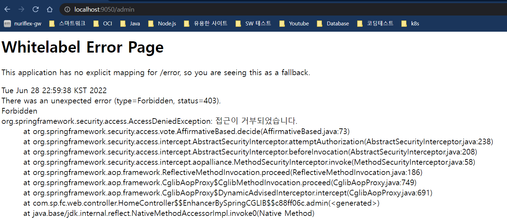
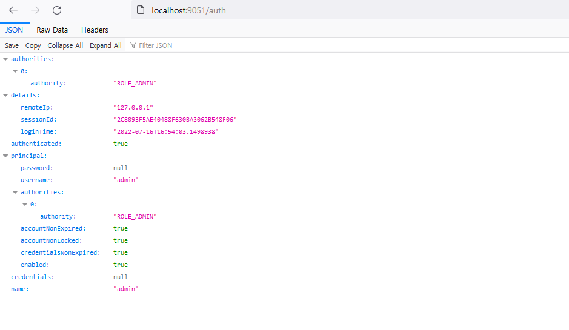

# Spring Security 교육 소개
## 선수 지식
- Java: jdk 11 이상 (modern java에 대해 알아야 함)
- spring boot: 스프링 애플리케이션 프레임워크
- gradle: 프로젝트 관리 및 빌드
- JUnit5(Jupyter)와 spring test: 기본적인 기능 테스트를 위해 필요함
- Spring 관련 전반 지식: Web MVC, RestFul 서비스, Spring Data JPA, AP, SpEL
- lombok: Getter/Setter/Builder 메소드 등 지원
- thymeleaf: 웹 프로그램을 지원함
- mysql: 데이터 테스트
- IntelliJ IDE
## 이 강의에서 다룰 내용
- Gradle 멀티 프로젝트 구성과 모듈 프로젝트 개발
- Spring Security의 기본 구조
- Spring Security를 활용한 로그인 방법 (Authentication)
- Spring Security를 활용한 권한 체크 방법 (Authorization)
- Ajax와 OAuth2 인증: ajax/OAuth2 인증 방식
## 실전 프로젝트
- 프로젝트 소스: https://github.com/jongwon/sp-fastcampus-spring-sec
- 강의에 사용한 소스는 아래 GitHub 사이트를 통해 받아 볼 수 있음
- master에는 초기 설정만 되어 있음
- 각각의 branch를 이동을 해서 테스트를 진행할 수 있음

## 프로그램에 사용한 Live Template
- IntelliJ > Settings > Editor > Live Templates 에 설정한 템플릿들이다.

- data
```java
import lombok.AllArgsConstructor;
import lombok.Builder;
import lombok.Data;
import lombok.NoArgsConstructor;

@Data
@AllArgsConstructor
@NoArgsConstructor
@Builder
```

- test1 ( ... test13)
```java
@DisplayName("1. $END$")
@Test
void test_1(){

}
```
# Gradle의 이해
## GroupId Vs Artifact Id
- 참고 문서: https://maven.apache.org/guides/mini/guide-naming-conventions.html
- GroupId
  - GroupId는 프로젝트를 정의하는 고유한 식별자 정보
  - GroupId는 Java package name rules을 따라야 함
- ArtifactId
  - 버전 없는 Jar파일 이름
  - 특수문자는 사용할 수 없고, 소문자만 사용되어야 함
- 정리하자면, GroupId는 큰 틀을 의미하고, ArtifactId는 그 안에 작은 틀을 의미
  - 예를 들어, 회사에서 정산시스템을 만든다면, GroupId는 회사명, ArtifactId는 주문정산, 월급정산 등 이런식으로 정의할 수 있음

## Gradle build.gradle의 동작원리
### build.gradle은 무엇인가?
- ``build.gradle``은 파일 자체가 ``Project Object(객체)``로, ``Project Object``는 Project 인터페이스를 구현하는 객체
- ``Project Object``는 Project 단위에서 필용한 작업을 수행하기 위해 모든 Method와 Property를 모아놓은 슈퍼 객체
```java
public interface Project extends Comparable<Project>, ExtensionAware, PluginAware {    
}
```
- ``build.gradle``에 작성하는 수많은 코드들은 모두 Project 오브젝트의 ``Property``와 ``Method``가 되며, ``Project Object``는 프로젝트 이름부터 필드, 메소드를 모두 포함하는 객체가 됨
- ``Project Object``의 대표적인 Method는 java application용 build.gradle이 가진 ``plugins, repositories, dependencies, application``
- Gradle Task를 이용해서 java application을 빌드하면, build task는 이 메소드들을 수행시킴

- 위의 이미지의 ``{}``로 감싸여진 부분은 메서드의 인자로 받아지는 Groovy의 ``Closure``인데, Groovy의 Closure는 Java나 Kotlin의 ``Lamda``와 같음
- 따라서, ``{}`` 블록 내부의 메소드들은 아래의 이미지처럼 인자로 넘겨질 수 도 있음

### build.gradle의 Property
- ``build.gradle``에는 Project Object를 위한 Property를 정의할 수 있음
#### Property 재정의하기
- Property를 정의하는 것은 간단. 아무 곳에난 아래의 문법을 사용하면 됨
```groovy
project.[property name] = [value]
```
- 혹은 project를 생략하고 사용할 수도 있음
```groovy
[property name] = [name]
```
- 예를 들어, Project Object의 group를 재정의하고 싶다면 아래와 같이 사용
  - ``group`` 또는 ``project.group``로 해당 Property에 접근 가능
```groovy
group = 'com.example'
project.group = 'com.kotlinworld'

repositories {
    println group // com.kotlinworld가 출력
    mavenCentral()
}
```
- 하지만, 이렇게 지정하는 것은 Project Object에 미리 정의된 Property만 정의하는 것이 가능하고, Custom Property를 만들려면 다른 방법을 사용해야 함
#### Custom Property 만들기
- Custom Property를 생성하기 위해서는 Project 객체의 extension에 넣는 방식을 사용
  - ``project.ext``를 통해 extension에 접근
```groovy
project.ext.[custom property name] = [value]
```
- project.ext에 넣어진 변수는 Groovy의 특수한 문법을 사용해 project object에서 직접 접근이 가능
```groovy
project.[custom property name]
```
- 예를 들어, blogName이란 custom property를 설정한 다음 출력하기 위해서는 다음과 같이 사용 가능
```groovy
project.ext.blogName = 'kotlin world'

repositories {
    println project.blogName // kotlin world 출력
    mavenCentral()
}
```
#### build.gradle의 Method
- ``build.gradle``에는 Project object를 위한 Method를 정의할 수 있음
- 대표적인 Method들은 바로 ``build.gradle``의 ``repositories`` method와 ``dependencies`` method임
```groovy
repositories {
    mavenCentral()
}

dependencies {
    testImplementation "junit:junit:4.13.2"
    implementation "com.google.guava:guava:30.1.1-jre"
}
```
- 위의 Method들은 ``build.gradle`` 속에 Method로 존재
  - 내부에 들어가는 Closure(Lambda 식)은 프로젝트가 빌드될 때 해당 메소드를 수행하는 task에 의해 수행됨
  
- 위의 Method들은 미리 빌드된 Method들임
  - Custom Method를 생성하기 위해서는 Method를 별도로 정의해야 함
#### Custom Method 생성하기
- ``Groovy``의 Lambda식인 ``Closure``와 Gradle의 ``ext``를 활용해 Custom Method를 손쉽게 생성 가능
```groovy
ext.[Method name] = { param1, param2 ->
    [Method Body]
}

project.ext.[Method name] = { param1, param2 ->
    [Method Body]
}
```
- 예를 들어, blogName을 출력하는 Custom Method를 생성하고 싶다면 아래와 같이 작성
```groovy
project.ext.getBlogName = { 
    return project.blogname
}
```
## Gradle 프로젝트 구성
- Gradle은 우선 ``settings.gradle`` 파일을 참고해 프로젝트의 구조를 파악
- 그런다음, 개별 프로젝트를 ``build.gradle``을 통해 빌드하는 방식으로 동작

### settings.gradle
settings 에서는 전체 프로젝트의 구조를 빌드한다. 일반적으로는
```groovy
rootProject.name="project-name"
include "project-name"
```
으로 한개의 프로젝트를 구성하지만, 여러 모듈 프로젝트들을 포함하는 경우에는

```groovy
rootProject.name="project-name"
include ":sub-project1"
include ":sub-project2"
```
와 같이 하위 프로젝트들을 포함시켜 준다.
하지만, 모듈 프로젝트들이 많아서 이들을 group 으로 관리하고 싶다면, 다음과 같이 자동 빌드하는 스크립트를 쓰면 편리하다.
```groovy
rootProject.name = 'security-gradle3'

["comp", "web", "server"].each {

    def compDir = new File(rootDir, it)
    if(!compDir.exists()){
        compDir.mkdirs()
    }

    compDir.eachDir {subDir ->

        def gradleFile = new File(subDir.absolutePath, "build.gradle")
        if(!gradleFile.exists()){
            gradleFile.text =
                    """

                    dependencies {

                    }

                    """.stripIndent(20)
        }

        [
                "src/main/java/com/sp/fc",
                "src/main/resources",
                "src/test/java/com/sp/fc",
                "src/test/resources"
        ].each {srcDir->
            def srcFolder = new File(subDir.absolutePath, srcDir)
            if(!srcFolder.exists()){
                srcFolder.mkdirs()
            }
        }

        def projectName = ":${it}-${subDir.name}";
        include projectName
        project(projectName).projectDir = subDir
    }
}
```
### build.gradle
Root 폴더의 ``build.gradle``에서는 전체 하위 프로젝트의 공통 설정에 대한 사항을 기술해 넣는다.
``build.gradle``는 크게 3가지 분류로 나뉜다.
- ``buildscript``
  - gradle 빌드 스크립트 자체를 위한 의존성이나 변수 Task, Plugin 을 지정
- ``allprojects``
  - 모든 프로젝트에 공통으로 넣을때 사용
- ``subprojects``
  - ``allprojects`` 와 비슷한 역할을 하지만, 차이점은 ``allprojects``의 경우 root project마저 같이 설정
  - 즉, java로 구성하면 root project 역시도 그렇게 되는 것 
```groovy
buildscript {
    ext {
        spring = "2.4.1"
        boot = "org.springframework.boot"
        lombok = "org.projectlombok:lombok"
    }
    repositories {
        mavenCentral()
    }
    dependencies {
        classpath("$boot:spring-boot-gradle-plugin:$spring")
    }
}

allprojects {
    group = "com.sp.fc"
    version = "1.0.0"
}

subprojects {
    apply plugin: "java"
    apply plugin: boot
    apply plugin: "io.spring.dependency-management"
    apply plugin: "idea"

    repositories {
        mavenCentral()
    }

    configurations {
        developmentOnly
        runtimeClasspath {
            extendsFrom developmentOnly
        }
    }

    dependencies {
        developmentOnly("$boot:spring-boot-devtools")
        implementation "$boot:spring-boot-starter-security"
        implementation 'com.fasterxml.jackson.core:jackson-annotations'

        compileOnly lombok
        testCompileOnly lombok
        annotationProcessor lombok
        testAnnotationProcessor lombok

        testImplementation "$boot:spring-boot-starter-test"
    }

    test {
        useJUnitPlatform()
    }
}


["comp", "web"].each {
    def subProjectDir = new File(projectDir, it)
    subProjectDir.eachDir {dir->
        def projectName = ":${it}-${dir.name}"
        project(projectName){
            bootJar.enabled(false)
            jar.enabled(true)
        }
    }
}
["server"].each {
    def subProjectDir = new File(projectDir, it)
    subProjectDir.eachDir {dir->
        def projectName = ":${it}-${dir.name}"
        project(projectName){

        }
    }
}

help.enabled(false)
```
### 프로젝트 auth reload 확성화 하기
- IntelliJ 에서 compiler.automake.allow.when.app.running 을 체크하고
- 설정의 Build project automatically 를 체크하고
- Run configuration 에서 On 'Update' action 과 On frame deactivation 의 값을 적절하게 수정해 줍니다.

참고 사이트 : https://velog.io/@bread_dd/Spring-Boot-Devtools
### 실습 (02. gradle 프로젝트 구성)
- Step 01. ``gradle`` 명령어를 통한 초기 프로젝트 구성
```bash
# 01. gradle init
gusam@DESKTOP-RF6D56E MINGW64 /d/Workspace/spring-security-practice/practice/02. gradle 프로젝트 구성 (main)
$ gradle init
<-------------> 0% EXECUTING [123ms]
# 02. Select build script DSL
Select type of project to generate:
  1: basic
  2: application
  3: library
  4: Gradle plugin
Enter selection (default: basic) [1..4] 1

<======-------> 50% EXECUTING [229ms]
><======-------> 50% EXECUTING [424ms]
<======-------> 50% EXECUTING [728ms]
<======-------> 50% EXECUTING [924ms]
<======-------> 50% EXECUTING [3s]
Select build script DSL:
  1: Groovy
  2: Kotlin
Enter selection (default: Groovy) [1..2] 1

<======-------> 50% EXECUTING [4s]
# 03. Project name. "sp-fastcampus-spring-sec"
Project name (default: 02. gradle 프로젝트 구성): sp-fastcampus-spring-sec
<======-------> 50% EXECUTING [6s]
<======-------> 50% EXECUTING [9s]
<======-------> 50% EXECUTING [11s]
<======-------> 50% EXECUTING [14s]
<======-------> 50% EXECUTING [16s]

> Task :init
Get more help with your project: Learn more about Gradle by exploring our samples at https://docs.gradle.org/6.9.1/samples

BUILD SUCCESSFUL in 20s
2 actionable tasks: 2 executed

gusam@DESKTOP-RF6D56E MINGW64 /d/Workspace/spring-security-practice/practice/02. gradle 프로젝트 구성 (main)
# 04. 생성된 파일 확인
$ ll
total 14
-rw-r--r-- 1 gusam 197609  206  6월 26 12:39 build.gradle
drwxr-xr-x 1 gusam 197609    0  6월 26 12:38 gradle/
-rwxr-xr-x 1 gusam 197609 5766  6월 26 12:38 gradlew*
-rw-r--r-- 1 gusam 197609 2763  6월 26 12:38 gradlew.bat
-rw-r--r-- 1 gusam 197609  383  6월 26 12:39 settings.gradle
```
- Step 02. IntelliJ로 ``build.gradle`` 파일을 열기 및 관련 파일 수정
  - Step 02-1. ``setting.gradle``파일의 내용을 Copy & Paste
  - Step 02-2. gradle refresh 처리: ``comp``, ``server``, ``web`` 디렉토리 생성 확인    
```groovy
rootProject.name = 'sp-fastcampus-spring-sec'

["comp", "web", "server"].each {

    def compDir = new File(rootDir, it)
    if(!compDir.exists()){
        compDir.mkdirs()
    }

    compDir.eachDir {subDir ->

        def gradleFile = new File(subDir.absolutePath, "build.gradle")
        if(!gradleFile.exists()){
            gradleFile.text =
                    """

                    dependencies {

                    }

                    """.stripIndent(20)
        }

        [
                "src/main/java/com/sp/fc",
                "src/main/resources",
                "src/test/java/com/sp/fc",
                "src/test/resources"
        ].each {srcDir->
            def srcFolder = new File(subDir.absolutePath, srcDir)
            if(!srcFolder.exists()){
                srcFolder.mkdirs()
            }
        }

        def projectName = ":${it}-${subDir.name}";
        include projectName
        project(projectName).projectDir = subDir
    }
}
```
- Step 03. IntelliJ의 ``server``폴더 아래에 ``basic-test``폴더를 생성한 후, gradle refresh 처리
  - ``basic-test`` 폴더 아래에 ``src`` 폴더와 ``build.gradle`` 파일이 생성됨을 확인
- Step 04. IntelliJ의 root 아래에 build.gradle을 아래와 같이 수정
  - Root 폴더의 ``build.gradle``에서는 전체 하위 프로젝트의 공통 설정에 대한 사항을 기술해 넣는다.
  - ``build.gradle``는 크게 3가지 분류로 나뉜다.
    - ``buildscript``: gradle 빌드 스크립트 자체를 위한 의존성이나 변수 Task, Plugin 을 지정
    - ``allprojects``: 모든 프로젝트에 공통으로 넣을때 사용
    - ``subprojects``: ``allprojects`` 와 비슷한 역할을 하지만, 차이점은 ``allprojects``의 경우 root project마저 같이 설정. 즉, java로 구성하면 root project 역시도 그렇게 되는 것
  - 아래의 ``build.gradle` 파일 분석
    - buildscript.ext: 추가(extension) 변수 설정
        - spring: spring version
        - boot: springboot group id 지정
        - lombok: lombok의 group id와 artifact id를 지정
    - buildscript.dependencies: springboot를 gradle로 빌드할 때 사용하는 라이브러리
    - allprojects: 모든 프로젝트에서 사용하게 될 group id와 version id를 정의
    - subprojects
      - ``apply plugin: "java"``
        - main과 test 폴더 아래에 위치한 java, resources 폴더를 Source와 resource 폴더로 인식함
        - Gradle에 관련된 Task들이 추가됨
          - ``build.assemble, build.build, build.buildDependents, build.buildNeeded, build.classes, build.clean, build.jar, build.testClasses``
          - ``other.compileJava, other.compileTestJava, other.processResources, other.processTestResources``
          - ``documentation.javadoc``
          - ``verification.check, verification.test`
      - ``apply plugin: boot apply plugin: "io.spring.dependency-management" apply plugin: "idea"``
        - spring boot와 관련된 Task들이 추가됨
          - ``build.bootJar``: 단독으로 실행가능한 jar을 빌드
            - 실행
              - 직접 jar 파일이 있는 곳에서 java -jar으로 실행해도 되고
              - 루트 디렉토리에서 아래 명령어를 실행해도 됨: ``$./gradlew bootRun``
          - ``application.bootRun, build.bootBuildImage, build.bootJar, build.bootJarMainClassName``
      - ``repositories`` 메소드: ``mavenCentral()``을 사용
      - ``dependencies`` 메소드: 라이브러리 의존성
    - ``bootJar.enabled``: 폴더 아래에 프로젝트 모듈이 생성될 때, ``server`` 폴더에서만 boot jar가 생성되도록 설정 
```groovy
buildscript {
    ext {
        spring = "2.4.1"
        boot = "org.springframework.boot"
        lombok = "org.projectlombok:lombok"
    }
    repositories {
        mavenCentral()
    }
    dependencies {
        classpath("$boot:spring-boot-gradle-plugin:$spring")
    }
}

allprojects {
    group = "com.sp.fc"
    version = "1.0.0"
}

subprojects {
    apply plugin: "java"
    apply plugin: boot
    apply plugin: "io.spring.dependency-management"
    apply plugin: "idea"

    repositories {
        mavenCentral()
    }

    configurations {
        developmentOnly
        runtimeClasspath {
            extendsFrom developmentOnly
        }
    }

    dependencies {
        developmentOnly("$boot:spring-boot-devtools")
        implementation "$boot:spring-boot-starter-security"
        implementation 'com.fasterxml.jackson.core:jackson-annotations'

        compileOnly lombok
        testCompileOnly lombok
        annotationProcessor lombok
        testAnnotationProcessor lombok

        testImplementation "$boot:spring-boot-starter-test"
    }

    test {
        useJUnitPlatform()
    }
}


["comp", "web"].each {
    def subProjectDir = new File(projectDir, it)
    subProjectDir.eachDir {dir->
        def projectName = ":${it}-${dir.name}"
        project(projectName){
            bootJar.enabled(false)
            jar.enabled(true)
        }
    }
}
["server"].each {
    def subProjectDir = new File(projectDir, it)
    subProjectDir.eachDir {dir->
        def projectName = ":${it}-${dir.name}"
        project(projectName){

        }
    }
}

help.enabled(false)
``
- Step 05. IntelliJ의 ``comp``폴더 아래에 ``common-utils``폴더를 생성한 후, gradle refresh 처리
  - ``comp\common-utils`` 폴더 아래에 모듈 생성(``src`` 폴더와 ``build.gradle`` 파일이 생성됨을 확인)
- Step 06. ``comp-compcommon-utils`` 프로젝트에서 Person Class 생성 후, ``server-basic-test`` 프로젝트에서 사용하기
  - ``server-basic-test`` 프로젝트의 build.gradle에 ``comp-compcommon-utils`` 프로젝트 의존성 추가
```groovy
dependencies {
    implementation("$boot:spring-boot-starter-web")
    compile project(":comp-common-utils")
}
```
# Spring Security란?
## 시큐리티가 필요한 이유
웹사이트는 각종 서비스를 하기 위한 리소스와 서비스를 사용하는 유저들의 개인 정보를 가지고 있습니다. 이들 리소스를 보호하기 위해서 일반적으로 웹 사이트는 두가지 보안 정책을 설정해야 합니다.

- 서버 리소스
- 유저들의 개인정보


## 인증 (Authentication)
사이트에 접근하는 사람이 누구인지 시스템이 알아야 합니다. 익명사용자(anonymous user)를 허용하는 경우도 있지만, 특정 리소스에 접근하거나 개인화된 사용성을 보장 받기 위해서는 반드시 로그인하는 과정이 필요합니다. 로그인은 보통 ``username / password`` 를 입력하고 로그인하는 경우와 sns 사이트를 통해 인증을 대리하는 경우가 있습니다.

- UsernamePassword 인증
  - Session 관리
  - 토큰 관리 (sessionless)
- Sns 로그인 (소셜 로그인) : 인증 위임

## 인가 혹은 권한(Authorization)
사용자가 누구인지 알았다면 사이트 관리자 혹은 시스템은 로그인한 사용자가 어떤 일을 할 수 있는지 권한을 설정합니다. 권한은 특정 페이지에 접근하거나 특정 리소스에 접근할 수 있는 권한여부를 판단하는데 사용됩니다. 개발자는 권한이 있는 사용자에게만 페이지나 리소스 접근을 허용하도록 코딩해야 하는데, 이런 코드를 쉽게 작성할 수 있도록 프레임워크를 제공하는 것이 ``스프링 시큐리티 프레임워크(Spring Security Framework)`` 입니다.
- Secured : deprecated
- PrePostAuthorize
- AOP

## 메모리 사용자 인증
간단히 특정된 소스를 위한 서비스나 테스트를 위해 사용하는 용도로 사용합니다. 스프링 시큐리티를 테스트 하기 위한 용도로 사용합니다.
- 기본 사용자 로그인
- ``application.yml``에 설정하고 로그인하기
- ``UserDetailService``를 이용하기
- ``WebSecurityConfigurerAdapter``를 사용하기

## 실습할 내용
1. basic-test 서버에 기본 사용자(user) 로 로그인한다
2. ``applicaiton.yml``에 user1 을 만들고 로그인한다.
3. 어플리케이션 객체에 ``UserDetailsService Bean``을 만들어서 로그인을 한다.
4. ``SecurityConfig``를 만들고 이를 통해 로그인 한다.
5. ``SecurityMessage (UserDetails, message)`` 를 통해 /user 페이지와 /admin 페이지 접근 권한을 테스트 한다.
## 실습한 내용 (03. 스프링 시큐리티란)
- ``git checkout 1-gradle-setting``로 브랜치 변경
- ``server/basic-test/build.gradle`` 파일을 수정
```groovy
dependencies {
    implementation("$boot:spring-boot-starter-web")
}
```
- ``@SpringBootApplication``을 위한 클래스 등록
```java
package com.sp.fc.web;
....
@SpringBootApplication
public class BasicTestApplication {
    public static void main(String[] args) {
        SpringApplication.run(BasicTestApplication.class, args);
    }
}
```
- ``server/basic-test/src/main/resources/application.yml``파일 생성 및 서버 포트 설정
```yaml
server:
  port: 9050
```
- Controller Class 작성
```java
package com.sp.fc.web.controller;
....
@RestController
public class HomeController {
    @RequestMapping("/")
    public String index() {
        return "홈페이지";
    }
}
```
- 서버 부팅 후, Browser를 통해 ``http://localhost:9050``에 접속하면 로그인 팝업 창이 뜸: 기본적으로 Spring Security가 동작하고 있기 때문

- 기본적인 사용자 명인 ``user``와 서버의 로그에 찍히는 패스워드를 이용해서 로그인 하면 됨
```bash
2022-06-27 22:52:41.497  INFO 11076 --- [  restartedMain] .s.s.UserDetailsServiceAutoConfiguration : 
Using generated security password: c3283119-f124-4938-846a-055a2c35cba5
2022-06-27 22:52:41.613  INFO 11076 --- [  restartedMain] o.s.s.web.Def
```
- 로그인하면, 원하는 내용이 웹브라우저에 표시됨

- 매번 암호를 확인해서 입력하기 힘들므로, ``server/basic-test/src/main/resources/application.yml``에 암호를 설정해서 사용할 수 있음
```yaml
server:
  port: 9050
spring:
  security:
    user:
      name: user1
      password: 1111
      roles: USER
```
- 현재 사용하고 있는 Authentication 정보를 브라우저에 찍어보는 방법
  - ``SecurityContextHolder``의 Context에서 Authentication 정보를 찍어봄
  - 브라우저에서 ``localhost:9050/auth``에 접속
```java
package com.sp.fc.web.controller;
....
@RestController
public class HomeController {
    ....
    @RequestMapping("/auth")
    public Authentication auth() {
        return SecurityContextHolder
                .getContext()
                .getAuthentication();
    }
}
```

- Controller Method에 대한 접근 권한 설정 방법
  - 참조: https://copycoding.tistory.com/278
  - 방법1: ``WebSecurityConfigureAdapter``를 상속한 ``WebSecurityConfig``를 작성
  - 방법2: Controller에 annotation을 추가하여 관리하는 방법
    - ``@PreAuthorize, @PostAuthorize, @Secured``를 사용('hasRole)
```java
package com.sp.fc.web.controller;
....
@RestController
public class HomeController {
    ....
    @PreAuthorize("hasAnyAuthority('ROLE_USER')")
    @RequestMapping("/user")
    public SecurityMessage user() {
        return SecurityMessage.builder()
                .auth(SecurityContextHolder.getContext().getAuthentication())
                .message("사용자 정보")
                .build();
    }

    @PreAuthorize("hasAnyAuthority('ROLE_ADMIN')")
    @RequestMapping("/admin")
    public SecurityMessage admin() {
        return SecurityMessage.builder()
                .auth(SecurityContextHolder.getContext().getAuthentication())
                .message("관리자 정보")
                .build();
    }
}

package com.sp.fc.web.dto;
....
@Data
@AllArgsConstructor
@NoArgsConstructor
@Builder
public class SecurityMessage {
    private Authentication auth;
    private String message;
}
```
- 하지만, ``USER`` 권한을 갖는 ``user1``이 ``localhost:9050/user``과 ``localhost:9050/admin``에 모두 접근 가능한 문제가 발생
  - **정보 탈취의 가능성이 있음**
  - 해결 방법: ``WebSecurityConfigurerAdapter``를 상속한 WebSecurityConfig를 선언
    - ``@EnableWebSecurity``와 ``@EnableGlobalMethodSecurity(prePostEnabled = true)`` annotate해서 Method의 ``@PreAuthorize``와 ``@PostAuthorize``를 가능하도록 설정하면 됨
```java
package com.sp.fc.web.config;
....
@EnableWebSecurity(debug = true)
@EnableGlobalMethodSecurity(prePostEnabled = true)
public class WebSecurityConfig extends WebSecurityConfigurerAdapter {
}
```
- ``user1``으로 접속한 후, ``localhost:9050/admin``에 접속하면 ``403`` 에러가 발생

- ``applcation.yml``에서는 하나의 User만 설정해서 사용가능
  - ``AuthenticationManagerBuilder`` ``inMemoryAuthentification``을 이용하여 사용자를 추가할 수 있음
  - ``inMemoryAuthentification``을 사용하면 더 이상 ``application.yml``에 등록한 사용자는 사용 못하게 됨
    - ``Bad credentials`` 에러가 발생
  - **아래와 같이 명시하면, Password Encoder를 사용하지 않아서 서버에서 에러가 발생함**
```java
package com.sp.fc.web.config;
.....
@EnableWebSecurity(debug = true)
@EnableGlobalMethodSecurity(prePostEnabled = true)
public class WebSecurityConfig extends WebSecurityConfigurerAdapter {
    @Override
    protected void configure(AuthenticationManagerBuilder auth) throws Exception {
        auth.inMemoryAuthentication()
                .withUser(User.builder()
                        .username("user2")
                        .password("2222")
                        .roles("USER"))
                .withUser(User.builder()
                        .username("admin")
                        .password("3333")
                        .roles("ADMIN"));
    }
}
```
```bash
2022-06-28 23:18:52.450 ERROR 23948 --- [nio-9050-exec-8] o.a.c.c.C.[.[.[/].[dispatcherServlet]    : Servlet.service() for servlet [dispatcherServlet] in context with path [] threw exception

java.lang.IllegalArgumentException: There is no PasswordEncoder mapped for the id "null"
	at org.springframework.security.crypto.password.DelegatingPasswordEncoder$UnmappedIdPasswordEncoder.matches(DelegatingPasswordEncoder.java:254) ~[spring-security-core-5.4.2.jar:5.4.2]
	at org.springframework.security.crypto.password.DelegatingPasswordEncoder.matches(DelegatingPasswordEncoder.java:202) ~[spring-security-core-5.4.2.jar:5.4.2]
	at org.springframework.security.config.annotation.web.configuration.WebSecurityConfigurerAdapter$LazyPasswordEncoder.matches(WebSecurityConfigurerAdapter.java:595) ~[spring-security-config-5.4.2.jar:5.4.2]
	at org.springframework.security.authentication.dao.DaoAuthenticationProvider.additionalAuthenticationChecks(DaoAuthenticationProvider.java:76) ~[spring-security-core-5.4.2.jar:5.4.2]
```
- 아래의 코드처럼, Password Encoder를 사용해서 비밀번호를 암호화 처리
  - admin으로 ``localhost:9050/admin, localhost:9050, localhost:9050/auth``에 접속되지만,
  - ``localhost:9050/user``에는 접속 안됨
```java
package com.sp.fc.web.config;
....
@EnableWebSecurity(debug = true)
@EnableGlobalMethodSecurity(prePostEnabled = true)
public class WebSecurityConfig extends WebSecurityConfigurerAdapter {
    @Override
    protected void configure(AuthenticationManagerBuilder auth) throws Exception {
        auth.inMemoryAuthentication()
                .withUser(User.builder()
                        .username("user2")
                        .password(passwordEncoder().encode("2222"))
                        .roles("USER"))
                .withUser(User.builder()
                        .username("admin")
                        .password(passwordEncoder().encode("3333"))
                        .roles("ADMIN"));
    }

    @Bean
    PasswordEncoder passwordEncoder() {
        return new BCryptPasswordEncoder();
    }
}
```
- 주소에 ``http://localhost:9050/logout``을 입력해서 로그아웃 할 수 있음
- Spring Security는 기본적으로 모든 페이지(/, /auth, /user, /admin)를 로그인이 없이는 사용 못하도록 막음
  - 왜냐면, ``WebSecurityConfigurerAdapter``의 ``configure()`` 메소드가 모든 페이지를 인증을 한 후, 사용하도록 설정
    - ``http.authorizeRequests((requests) -> requests.anyRequest().authenticated());``
```java
public abstract class WebSecurityConfigurerAdapter implements WebSecurityConfigurer<WebSecurity> {
....    
    protected void configure(HttpSecurity http) throws Exception {
		this.logger.debug("Using default configure(HttpSecurity). "
				+ "If subclassed this will potentially override subclass configure(HttpSecurity).");
		http.authorizeRequests((requests) -> requests.anyRequest().authenticated());
		http.formLogin();
		http.httpBasic();
	}
....
}    
```    
- 만약, 특정 페이지(``/``)는 로그인 없이 사용하기를 원한다면?
  - ``protected void configure(HttpSecurity http) throws Exception`` 함수를 재정의 하면 됨
  - ``antMatchers``를 이용해서, ``/``은 로그인 없이 사용하도록 ``permitAll()``을 호출 
  - ``antMatchers``로 맵핑되지 않은 페이지들은 ``anyRequest().authenticated()``를 이용해서 로그인을 요청
```java
package com.sp.fc.web.config;
....
@EnableWebSecurity(debug = true)
@EnableGlobalMethodSecurity(prePostEnabled = true)
public class WebSecurityConfig extends WebSecurityConfigurerAdapter {
    .....
    @Override
    protected void configure(HttpSecurity http) throws Exception {
        http.authorizeRequests((requests) ->
                requests.antMatchers("/").permitAll()
                        .anyRequest().authenticated());
        http.formLogin();
        http.httpBasic();
    }
    ....
}
``` 
- 서버 재시작 후, ``http://localhost:9050/``은 로그인 없이 접근 가능 
- 다른 페이지로 접근하면, 로그인을 요청 받음
- 전체 소스
  - ``.\practice\03. 스프링 시큐리티란\sp-fastcampus-spring-sec`` 참조
# Spring Security의 전체 구조
## Servlet Container
- ``Tomcat``와 같은 웹 애플리케이션을 ``Servlet Container``라고 부르는데, 이런 웹 애플리케이션(J2EE Application)은 기본적으로 ``Filter``와 ``Servlet``으로 구성되어 있음

- Filter은 Chain처럼 엮여있기 때문에 ``Filter Chain``이라고도 불리는데, 모든 request는 이 ``Filter Chain``을 반드시 거쳐야만 Servlet 서비스에 도착하게 됨
## Spring Security의 큰 그림
- 그래서 ``Spring Security``는 ``DelegatingFilterProxy``라는 필터를 만들어 ``Main Filter Chain``에 끼워넣고, 그 아래 다시 ``SecurityFilterChain Group``을 등록함
- 결국, ``DelegatingFilterProxy``를 이용하여 API에 따라서 동작시키는 ``Filter Chain``을 다르게 가져갈 수 있음

- 이 ``Filter Chain``은 반드시 한 개 이상이고, ``URL Pattern``에 따라 적용되는 필터체인을 다르게 할 수 있음
- 본래의 Main Filter를 반드시 통과해야만 Servlet에 들어갈 수 있는 단점을 보완하기 위해서 ``Filter Chain Proxy(DelegatingFilterProxy)``를 두었다고 할 수 있음
- ``web resource``의 경우 Pattern을 따르더라도 Filter를 무시(ignore)하고 통과시켜주기도 함
## Security Filters
- 이 ``Filter Chain``에는 다양한 필터들이 들어갑니다.

- 각각의 Filter는 **단일 Filter 단일 책임(?)원칙**처럼, 각기 서로 다른 관심사를 해결함. 예를 들면 아래와 같음
  - ``HeaderWriterFilter`` : Http Header를 검사한 후, 필요한 Header를 추가하거나 삭제
  - ``CorsFilter`` : 허가된 사이트나 클라이언트의 요청인지 검사
  - ``CsrfFilter`` : POST나 PUT과 같이 서버 Resource를 변경하는 경우, 서버가 내려보낸 Resource에서 올라온 요청인지 검사 (중요)
  - ``LogoutFilter`` : 현재의 Request가 로그아웃을 하겠다는 건지 검사
  - ``UsernamePasswordAuthenticationFilter`` : 현재의 Request가 ``username / password`` 로 로그인을 하려는지 검사 후, 로그인 정보를 이용하여 Authentification을 사용자에게 부여해 주거나 인증 실패 처리를 해줌
  - ``ConcurrentSessionFilter`` : 하나의 사용자가 동시에 여기저기서 로그인 하는걸 허용할 것인가?
  - ``BearerTokenAuthenticationFilter`` : Authorization Header에 Bearer 토큰을 검사해서 인증 처리
  - ``BasicAuthenticationFilter`` : Authorization Header에 Basic 토큰을 검사해서 인증처리
  - ``RequestCacheAwareFilter`` : 방금 요청한 request 이력이 다음에 필요할 수 있으니 캐시에 담아놓는 역할
  - ``SecurityContextHolderAwareRequestFilter`` : 보안 관련 Servlet 3 스펙을 지원하기 위한 Filter
  - ``RememberMeAuthenticationFilter`` : ``RememberMe``는 세션이 만료되더라도 Login을 다시하지 않고, 사용하도록 처리해주는 기능. 아직 Authentication 인증이 안된 경우라면 ``RememberMe Cookie``를 검사해서 인증 처리해주는 기법
  - ``AnonymousAuthenticationFilter`` : Filter Chain의 이전 Filter들에 의해서 아직도 인증이 되지 않았다면 Anonymous User로 Authentification을 채워주는 역할
  - ``SessionManagementFilter`` : 서버에서 지정한 세션정책에 맞게 사용자가 사용하는지 검사
  - ``ExceptionTranslationFilter`` : 해당 Filter 이후(``FilterSecurityInterceptor``)에 인증이나 권한 예외가 발생하면 ``ExceptionTranslationFilter``가 잡아서 처리
  - ``FilterSecurityInterceptor`` : 여기까지 살아서 왔다면 Authentification이 있다는 거니, 사용자  request의 Controller Method 들어갈 권한이 있는지, 리턴한 결과를 사용자에게 보내줘도 되는건지 마지막으로 점검
  - 그 밖에... ``OAuth2, Saml2, Cas, X509`` 등에 관한 Filter들도 있음
- Filter는 넣거나 뺄 수 있고, 순서를 조절할 수 있음 (이때, 필터의 순서가 매우 critical 할 수 있기 때문에 기본 필터들은 그 순서가 어느정도 정해져 있음)
## 특정 Request에서 어떤 Filter들이 동작하는 확인하는 방법
- ``WebSecurityConfigurerAdapter``를 상속받아서 구현한 클래스에 ``@EnableWebSecurity(debug = true)`` annotation에서 ``debug`` 옵션을 켜줌
```java
@EnableWebSecurity(debug = true)
@EnableGlobalMethodSecurity(prePostEnabled = true)
public class WebSecurityConfig extends WebSecurityConfigurerAdapter {
....
}
```
```bash
....
servletPath:/admin
pathInfo:null
headers: 
host: localhost:9050
user-agent: Mozilla/5.0 (Windows NT 10.0; Win64; x64; rv:101.0) Gecko/20100101 Firefox/101.0
accept: text/html,application/xhtml+xml,application/xml;q=0.9,image/avif,image/webp,*/*;q=0.8
accept-language: en-US,en;q=0.5
accept-encoding: gzip, deflate, br
referer: http://localhost:9050/login
connection: keep-alive
cookie: JSESSIONID=8F88F2B96AE73D48A0F1DC01AEF67C5B
upgrade-insecure-requests: 1
sec-fetch-dest: document
sec-fetch-mode: navigate
sec-fetch-site: same-origin
sec-fetch-user: ?1


Security filter chain: [
  WebAsyncManagerIntegrationFilter
  SecurityContextPersistenceFilter
  HeaderWriterFilter
  CsrfFilter
  LogoutFilter
  UsernamePasswordAuthenticationFilter
  DefaultLoginPageGeneratingFilter
  DefaultLogoutPageGeneratingFilter
  BasicAuthenticationFilter
  RequestCacheAwareFilter
  SecurityContextHolderAwareRequestFilter
  AnonymousAuthenticationFilter
  SessionManagementFilter
  ExceptionTranslationFilter
  FilterSecurityInterceptor
]
....
```
- ``WebSecurityConfigurerAdapter``를 상속한 클래스의 ``configure(HttpSecurity http)`` 메소드에서 다양한 Filter들을 Enable/Disable 시킬 수 있음
  - ``http.authorizeRequests(), http.formLogin(), http.httpBasic()``를 주석처리하게 되면, 아래의 Filter들을 사용하지 않게 됨
    - ``UsernamePasswordAuthenticationFilter``
    - ``DefaultLoginPageGeneratingFilter`` 
    - ``DefaultLogoutPageGeneratingFilter``
    - ``BasicAuthenticationFilter``
    - ``FilterSecurityInterceptor``
```java
@EnableWebSecurity(debug = true)
@EnableGlobalMethodSecurity(prePostEnabled = true)
public class WebSecurityConfig extends WebSecurityConfigurerAdapter {
    ....
    @Override
    protected void configure(HttpSecurity http) throws Exception {
//        http.authorizeRequests((requests) ->
//                requests.antMatchers("/").permitAll()
//                        .anyRequest().authenticated());
//        http.formLogin();
//        http.httpBasic();
    }
    ....
}
```
```bash
...
Security filter chain: [
  WebAsyncManagerIntegrationFilter
  SecurityContextPersistenceFilter
  HeaderWriterFilter
  CsrfFilter
  LogoutFilter
  RequestCacheAwareFilter
  SecurityContextHolderAwareRequestFilter
  AnonymousAuthenticationFilter
  SessionManagementFilter
  ExceptionTranslationFilter
]
...
```
- 아래의 코드처럼, ``Filter Chain``에서 다양한 Filter들을 disable시킬 수 있음 
  - ``HeaderWriterFilter``
  - ``CsrfFilter``
  - ``LogoutFilter``
  - ``RequestCacheAwareFilter``  
```java
package com.sp.fc.web.config;
....
@EnableWebSecurity(debug = true)
@EnableGlobalMethodSecurity(prePostEnabled = true)
public class WebSecurityConfig extends WebSecurityConfigurerAdapter {
    @Override
    protected void configure(HttpSecurity http) throws Exception {
//        http.authorizeRequests((requests) ->
//                requests.antMatchers("/").permitAll()
//                        .anyRequest().authenticated());
//        http.formLogin();
//        http.httpBasic();
        http.headers().disable()
            .csrf().disable()
            .logout().disable()
            .requestCache().disable();
    }
}
```
```bash
......
Security filter chain: [
  WebAsyncManagerIntegrationFilter
  SecurityContextPersistenceFilter
  SecurityContextHolderAwareRequestFilter
  AnonymousAuthenticationFilter
  SessionManagementFilter
  ExceptionTranslationFilter
]
```
- 특정 API에 대해서 Filter Chain을 적용하고 싶은 경우
  - ``WebSecurityConfigurerAdapter``를 상속한 클래스의 ``configure(HttpSecurity http)`` 메소드에서 ``HttpSecurity``에 ``antMatcher()``를 적용하면 됨
```java
package com.sp.fc.web.config;
....
@EnableWebSecurity(debug = true)
@EnableGlobalMethodSecurity(prePostEnabled = true)
public class WebSecurityConfig extends WebSecurityConfigurerAdapter {
    @Override
    protected void configure(HttpSecurity http) throws Exception {
       // 모든 API에 대해 아래의 Filter Chain 적용
       // http.antMatcher("/**");
       // "/api" 아래의 모든 API에 대해 아래의 Filter Chain 적용
       http.antMatcher("/api/**");
       http.authorizeRequests((requests) ->
               requests.antMatchers("/").permitAll()
                       .anyRequest().authenticated());
       http.formLogin();
       http.httpBasic();
    }
}
```
- 두 개 이상의 ``Filter Chain``을 구성하고 싶다면?
  - ``WebSecurityConfigurerAdapter``를 상속한 여러 개의 Config Class를 정의하면 됨
  - 여러 개의 클래스(``Filter Chain``)가 있으므로, ``@Order`` Annotation을 통해서 순서를 지정해 줌
```java
package com.sp.fc.web.config;
....
@Order(1)
@EnableWebSecurity(debug = true)
@EnableGlobalMethodSecurity(prePostEnabled = true)
public class WebSecurityConfig extends WebSecurityConfigurerAdapter {
    .....
}
```
## 로그인하기
- Spring Framework에서 로그인을 한다는 것은 authenticated 가 true인 ``Authentication`` 객체를 ``SecurityContext``에 갖고 있는 상태를 말함
  - 단, Authentication이 AnonymousAuthenticationToken만 아니면 됨
  ```
  로그인 == Authentication(authenticated = true) only if Authentication != AnonymousAuthenticationToken
  ```
### Authentication (인증)의 기본 구조
- Filter들 중에 일부 Filter는 인증 정보에 관여
  - 이들 Filter가 하는 일은 ``AuthenticationManager``를 통해 Authentication을 인증하고 그 결과를 SecurityContextHolder에 넣어주는 일임
  - ``ProviderManger``은 ``AuthenticationManager``의 구현체 클래스
  - ``ProviderManger``은 parent란 참조를 통해 다른 ``ProviderManger``를 가리킴
  - ``ProviderManger``은 여러 개의 ``AuthenticationProvider``로 구성

- Authentication(인증 토큰)을 제공하는 Filter들
  - ``UsernamePasswordAuthenticationFilter``
    - 폼 로그인 -> ``UsernamePasswordAuthenticationToken``
  - ``RememberMeAuthenticationFilter``
    - ``remember-me Cookie`` 로그인 -> ``RememberMeAuthenticationToken``
  - ``AnonymousAuthenticationFilter``
    - 로그인하지 않았다는 것을 인증함 -> ``AnonymousAuthenticationToken``
  - ``SecurityContextPersistenceFilter``
    - 기존 로그인을 유지함(기본적으로 ``session``을 이용)
  - ``BearerTokenAuthenticationFilter``
    - ``JWT`` 로그인
  - ``BasicAuthenticationFilter``
    - ``Authorization`` Header에 Username과 Password를 담아서 Base64로 Encoding해서 보내줌
    - ``ajax`` 로그인 -> ``UsernamePasswordAuthenticationToken``
  - ``OAuth2LoginAuthenticationFilter``
    - 소셜 로그인 -> ``OAuth2LoginAuthenticationToken, OAuth2AuthenticationToken``
  - ``OpenIDAuthenticationFilter``
    - ``OpenID`` 로그인
  - ``Saml2WebSsoAuthenticationFilter``
    - ``SAML2`` 로그인
  - ... 기타
- Authentication을 제공(Provide) 하는 인증제공자는 여러 개가 동시에 존재할 수 있고, 인증 방식에 따라 ``ProviderManager``도 복수로 존재할 수 있음
- ``Authentication``은 Interface로 아래와 같은 정보들을 갖고 있음
  - ``Set<GrantedAuthority> authorities``: 인증된 권한 정보
  - ``principal``: 인증 대상에 관한 정보. 주로 ``UserDetails`` 객체가 옴
  - ``credentials``: 인증 확인을 위한 정보. 주로 ``Password``가 오지만, ``Password``는 인증 후에는 보안을 위해 삭제함
  - ``details``: 로그인 Request에 대한 상세 정보. ``IP, 세션정보, 기타 인증요청에서 사용했던 정보``들.
  - ``boolean authenticated``: 인증이 되었는지를 체크
## Form Login
- ID와 Password를 이용해서 Login
### DefaultLoginPageGeneratingFilter
- ``GET /login``을 처리
- 별도의 로그인 페이지 설정을 하지 않으면 제공되는 필터
- 기본 Login Form Page을 제공
- ``OAuth2 / OpenID / Saml2`` 로그인과도 같이 사용할 수 있음
- 아래의 코드처럼, HTML을 통해 직접 로그인 페이지를 생성
```java
package org.springframework.security.web.authentication.ui;
......
/**
 * For internal use with namespace configuration in the case where a user doesn't
 * configure a login page. The configuration code will insert this filter in the chain
 * instead.
 *
 * Will only work if a redirect is used to the login page.
 *
 * @author Luke Taylor
 * @since 2.0
 */
public class DefaultLoginPageGeneratingFilter extends GenericFilterBean {
	public static final String DEFAULT_LOGIN_PAGE_URL = "/login";
	public static final String ERROR_PARAMETER_NAME = "error";
  ...
  private String generateLoginPageHtml(HttpServletRequest request, boolean loginError, boolean logoutSuccess) {
    String errorMsg = "Invalid credentials";
    if (loginError) {
      HttpSession session = request.getSession(false);
      if (session != null) {
        AuthenticationException ex = (AuthenticationException) session
            .getAttribute(WebAttributes.AUTHENTICATION_EXCEPTION);
        errorMsg = (ex != null) ? ex.getMessage() : "Invalid credentials";
      }
    }
    String contextPath = request.getContextPath();
    StringBuilder sb = new StringBuilder();
    sb.append("<!DOCTYPE html>\n");
    sb.append("<html lang=\"en\">\n");
    ....
    if (this.formLoginEnabled) {
      sb.append("      <form class=\"form-signin\" method=\"post\" action=\"" + contextPath
          + this.authenticationUrl + "\">\n");
      .....
    }
    if (this.openIdEnabled) {
      sb.append("      <form name=\"oidf\" class=\"form-signin\" method=\"post\" action=\"" + contextPath
          + this.openIDauthenticationUrl + "\">\n");
      .....
    }
    if (this.oauth2LoginEnabled) {
      sb.append("<h2 class=\"form-signin-heading\">Login with OAuth 2.0</h2>");
      .....
    }
    if (this.saml2LoginEnabled) {
      sb.append("<h2 class=\"form-signin-heading\">Login with SAML 2.0</h2>");
      ....
    }
    ....
```
### UsernamePasswordAuthenticationFilter
- ``POST /login``을 처리
- ``processingUrl``을 변경하면 주소를 바꿀 수 있음
- ``Form`` 인증을 처리해주는 Filter로 Spring Security에서 가장 일반적으로 쓰임
- 주요 설정 정보
  - ``filterProcessingUrl``: 로그인을 처리해 줄 URL (POST)
  - ``username`` parameter: POST에 username에 대한 값을 넘겨줄 인자의 이름
  - ``password`` parameter: POST에 password에 대한 값을 넘겨줄 인자의 이름
  - 로그인 성공시 처리 방법
    - ``defaultSuccessUrl()``: 두번째 인자인 ``alwaysUse``옵션 설정이 중요
    - ``successHandler``: ``defaultSuccessUrl``와 Exclusive한 옵션
  ```java
  @EnableWebSecurity(debug = true)
  @EnableGlobalMethodSecurity(prePostEnabled = true)
  public class WebSecurityConfig extends WebSecurityConfigurerAdapter {
      ....
      @Override
      protected void configure(HttpSecurity http) throws Exception {
          // 모든 API에 대해서 아래의 Filter Chain 적용
          http.antMatcher("/**");
          // "/api" 아래의 모든 API 아래의 Filter Chain 적용
          // http.antMatcher("/api/**");
          http.authorizeRequests((requests) ->
                  requests.antMatchers("/").permitAll()
                          .anyRequest().authenticated());
          // 사용자가 로그인 후, 원하는 페이지로 이동하려면, 두번째 인자인 alwaysUse를 false로 설정
          // alwaysUse를 true로 설정하면, 무조건 "/" page로 이동
          http.formLogin(login -> login.defaultSuccessUrl("/", false));
          http.httpBasic();
      }
      ....
  }
  ```  
  - 로그인 실패시 처리 방법
    - ``failureUrl``
    - ``failureHandler``
  - ``authenticationDetailSource``: ``Authentication`` 객체의 ``details``에 들어갈 정보를 직접 만들어 줌
    - 아래 코드는 ``UsernamePasswordAuthenticationFilter``에서 인증을 진행하는 코드
    - ``AuthenticationManager``는 가지고 있는 ``AuthenticationProvider``들에게 인증 가능 여부를 물어봄
    - 성공하는 경우, 인증된 ``Authentication`` 객체를 반환
    - ``details``에 들어갈 정보(IP, Session 등)도 생성
  ```java
  public class UsernamePasswordAuthenticationFilter extends AbstractAuthenticationProcessingFilter {
    ....      
    @Override
    public Authentication attemptAuthentication(HttpServletRequest request, HttpServletResponse response)
        throws AuthenticationException {
      if (this.postOnly && !request.getMethod().equals("POST")) {
        throw new AuthenticationServiceException("Authentication method not supported: " + request.getMethod());
      }
      String username = obtainUsername(request);
      username = (username != null) ? username : "";
      username = username.trim();
      String password = obtainPassword(request);
      password = (password != null) ? password : "";
      UsernamePasswordAuthenticationToken authRequest = new UsernamePasswordAuthenticationToken(username, password);
      // Allow subclasses to set the "details" property
      setDetails(request, authRequest);
      return this.getAuthenticationManager().authenticate(authRequest);
    }
    .....
  }  
  ```
### DefaultLogoutPageGeneratingFilter
- ``GET /logout``을 처리
- ``POST /logout``을 요청할 수 있는 UI 를 제공
- ``DefaultLoginPageGeneratingFilter``를 사용하는 경우에 같이 제공됨.
### LogoutFilter
- ``POST /logout``을 처리
- ``processiongUrl``을 변경하면 바꿀 수 있음
- 로그 아웃을 처리
  - ``session, SecurityContext, csrf, 쿠키, remember-me Cookie`` 등을 삭제 처리
  - (기본) 로그인 페이지로 redirect
```java
public class LogoutFilter extends GenericFilterBean {
  .... 
  private void doFilter(HttpServletRequest request, HttpServletResponse response, FilterChain chain)
      throws IOException, ServletException {
    // request의 URL이 /logout 페이지가 맞는지 검사
    if (requiresLogout(request, response)) {
      Authentication auth = SecurityContextHolder.getContext().getAuthentication();
      if (this.logger.isDebugEnabled()) {
        this.logger.debug(LogMessage.format("Logging out [%s]", auth));
      }
      this.handler.logout(request, response, auth);
      this.logoutSuccessHandler.onLogoutSuccess(request, response, auth);
      return;
    }
    chain.doFilter(request, response);
  }
  ....
}
```
- ``LogoutHandler``
  - Interface 정의
    - ``void logout(HttpServletRequest request, HttpServletResponse response, Authentication authentication)``
  - 여러 종류의 ``LogoutHandler``가 존재  
  - ``SecurityContextLogoutHandler``
    - 세션과 SecurityContext 를 clear
  - ``CookieClearingLogoutHandler``
    - clear 대상이 된 쿠키들을 삭제
  - ``CsrfLogoutHandler``
    - ``csrfTokenRepository``에서 ``csrf`` 토큰을 clear
  - ``HeaderWriterLogoutHandler``
  - ``RememberMeServices``
    - remember-me 쿠키를 삭제
  - ``LogoutSuccessEventPublishingLogoutHandler``
    - 로그아웃이 성공하면 이벤트를 발행
- ``LogoutSuccessHandler``
  - Interface 정의
    - ``void onLogoutSuccess(HttpServletRequest request, HttpServletResponse response, Authentication authentication)
    throws IOException, ServletException``
  - ``SimpleUrlLogoutSuccessHandler``
## Basic-Login 실습 (03-2. Basic Login)
- 기획자가 아래와 같은 사이트를 기획했다고 가정

- 디자이너는 이 사이트를 아래와 같이 디자인 했다고 가정

- 로그인 페이지를 만들고 기본적인 페이지의 flow 를 실습
### Page에 Security 설정하기
- ``thymeleaf``에 대한 의존성 추가
- ``bootstrap``을 이용해 기본 페이지 제작
- 기본 로그인 페이지 제작
- ``csrf`` 설정
- 로그인 성공시 설정
- 로그인 실패시 설정
- 로그아웃 설정
- ``UserDetailsSource`` 설정
### build.gradle 설정
- ``D:\Workspace\spring-security-practice\practice\03-2. Basic Login\sp-fastcampus-spring-sec\server\login-basic\build.gradle``
  - ``thymeleaf`` library 관련 라이브러리 설정 (Spring Security관련된 것도 포함)
  ```groovy
  dependencies {

    implementation("$boot:spring-boot-starter-web")
    implementation("$boot:spring-boot-starter-thymeleaf")
    implementation("org.thymeleaf.extras:thymeleaf-extras-springsecurity5")
    implementation("nz.net.ultraq.thymeleaf:thymeleaf-layout-dialect")
  }
  ```
### 코드
- Step 01. 코드의 초기 상태
  - 디자이너가 생성해준 thymeleaf를 포함하고 있는 template html이 존재
  - 모든 URL에 대해 Security Filter가 존재하지 않아서 권한 체크없이 접근 가능한 상태
  - 아래 페이지는 "/" 페이지에 접근한 상태
  
```java
package com.sp.fc.web.controller;
....
@Controller
public class HomeController {

    @GetMapping("/")
    public String main(){
        return "index";
    }

    @GetMapping("/login")
    public String login(){
        return "loginForm";
    }

    @GetMapping("/login-error")
    public String loginError(Model model){
        model.addAttribute("loginError", true);
        return "loginForm";
    }

    @GetMapping("/access-denied")
    public String accessDenied(){
        return "AccessDenied";
    }

    @PreAuthorize("hasAnyAuthority('ROLE_USER')")
    @GetMapping("/user-page")
    public String userPage(){
        return "UserPage";
    }

    @PreAuthorize("hasAnyAuthority('ROLE_ADMIN')")
    @GetMapping("/admin-page")
    public String adminPage(){
        return "AdminPage";
    }
}

package com.sp.fc.web.config;
.....
@EnableWebSecurity(debug = true)
public class SecurityConfig extends WebSecurityConfigurerAdapter {
    @Override
    protected void configure(HttpSecurity http) throws Exception {
        http
                .authorizeRequests(request->{
                    request
                            .antMatchers("/**").permitAll()
                            ;
                })
                ;
    }
}
```
- Step 02. ``Root Context``에 대해서는 모두가 접근 가능하고, 다른 페이지들은 인증이 필요한 상태로 변경
  - "/"에 접근하면, 아래 이미지처럼 ``css와 js``가 다운로드되지 않아서 문제가 발생

  - ``WebSecurity``에 대해 정적 Resource를 포함하는 Path에 대해서 ``HttpSecurity``에 의한 Security Filter를 체크하지 않도록 변경

  - ``http://localhost:9051`` Root Page를 제외하면, 모두 403 error ("Access Denied")가 발생 
  ```java
  package com.sp.fc.web.config;
  ....
  @EnableWebSecurity(debug = true)
  public class SecurityConfig extends WebSecurityConfigurerAdapter {
      @Override
      protected void configure(HttpSecurity http) throws Exception {
          http
                  .authorizeRequests(request -> {
                      request
                              .antMatchers("/").permitAll()
                              .anyRequest().authenticated()()
                      ;
                  })
          ;
      }

      @Override
      public void configure(WebSecurity web) throws Exception {
          web.ignoring()
                  .requestMatchers(
                          PathRequest.toStaticResources().atCommonLocations()
                  );
      }
  }
  ```
- Step 03. 일단 권한이 없는 페이지에 접근하는 경우 Form Login 페이지로 이동하도록 설정
  - ``HttpSecurity``에 인자없이 ``formLogin()``을 추가
    - HomeController의 ``/login``이 아닌 ``DefaultLoginPageGeneratingFilter``가 생성한 페이지를 사용
  ```java
  package com.sp.fc.web.config;
  .....
  @EnableWebSecurity(debug = true)
  public class SecurityConfig extends WebSecurityConfigurerAdapter {

      @Override
      protected void configure(HttpSecurity http) throws Exception {
          http
                  .authorizeRequests(request -> {
                      request
                              .antMatchers("/").permitAll()
                              .anyRequest().authenticated();
                  }).formLogin();
      }
      ....
  }
  ```
  ```bash
  ************************************************************
  Request received for GET '/login':

  org.apache.catalina.connector.RequestFacade@36db1f66

  servletPath:/login
  pathInfo:null
  headers: 
  host: localhost:9051
  connection: keep-alive
  sec-ch-ua: ".Not/A)Brand";v="99", "Google Chrome";v="103", "Chromium";v="103"
  sec-ch-ua-mobile: ?0
  sec-ch-ua-platform: "Windows"
  upgrade-insecure-requests: 1
  user-agent: Mozilla/5.0 (Windows NT 10.0; Win64; x64) AppleWebKit/537.36 (KHTML, like Gecko) Chrome/103.0.0.0 Safari/537.36
  accept: text/html,application/xhtml+xml,application/xml;q=0.9,image/avif,image/webp,image/apng,*/*;q=0.8,application/signed-exchange;v=b3;q=0.9
  sec-fetch-site: none
  sec-fetch-mode: navigate
  sec-fetch-user: ?1
  sec-fetch-dest: document
  accept-encoding: gzip, deflate, br
  accept-language: ko,ko-KR;q=0.9,en-US;q=0.8,en;q=0.7
  cookie: Idea-f0de6e50=da80e525-5e47-4853-b218-f3ccc047f11d; JSESSIONID=206260DA7D5832AFB17D7486D78D64A4


  Security filter chain: [
    WebAsyncManagerIntegrationFilter
    SecurityContextPersistenceFilter
    HeaderWriterFilter
    CsrfFilter
    LogoutFilter
    UsernamePasswordAuthenticationFilter
    DefaultLoginPageGeneratingFilter
    DefaultLogoutPageGeneratingFilter
    RequestCacheAwareFilter
    SecurityContextHolderAwareRequestFilter
    AnonymousAuthenticationFilter
    SessionManagementFilter
    ExceptionTranslationFilter
    FilterSecurityInterceptor
  ]
  ************************************************************
  ```
- Step 03-1. Custom Login Page를 사용하도록 설정
  - ``HttpSecurity``에 ``formLogin()``의 Lambda 함수를 통해 로그인 페이지("/login") 지정
  - ``Login Page("/login")``가 인증이 필요하면 무한루프가 발생
    - ``permitAll()``을 통해서 권한없이 접근 가능하도록 허용
  ```java
  package com.sp.fc.web.config;
  ....
  @EnableWebSecurity(debug = true)
  public class SecurityConfig extends WebSecurityConfigurerAdapter {
      @Override
      protected void configure(HttpSecurity http) throws Exception {
          http
                  .authorizeRequests(request -> {
                      request
                              .antMatchers("/").permitAll()
                              .anyRequest().authenticated();
                  }).formLogin(
                          t -> t.loginPage("/login").permitAll()
                  );
      }
      ....
  }
  ```
- Step 04. 로그인을 위한 사용자 정보를 메모리에 생성
  - Test에 한정해서 ``User.withDefaultPasswordEncoder``를 사용 가능
    - Production에서는 안전하지 않음 (Deprecated된 Method)
```java
package com.sp.fc.web.config;
....
@EnableWebSecurity(debug = true)
public class SecurityConfig extends WebSecurityConfigurerAdapter {
    ......
    @Override
    protected void configure(AuthenticationManagerBuilder auth) throws Exception {
        auth
                .inMemoryAuthentication()
                .withUser(
                        User.withDefaultPasswordEncoder()
                                .username("user1")
                                .password("1111")
                                .roles("USER")
                ).withUser(
                        User.withDefaultPasswordEncoder()
                                .username("admin")
                                .password("2222")
                                .roles("ADMIN")
                );
    }
}
```
- Step 04-1. 설정 후, 로그인 페이지에서 로그인을 시도해도 다음 페이지로 이동하지 않음
  - 문제의 원인은 csrf filter에 의해서 웹 페이지가 보낸 csrf token을 체크하기 때문
    - ``CsrfFilter::doFilterInternal()`` Method에 해당 로직이 존재    
  - 아래의 코드는 thymeleaf에서 csrf token을 활성화 시키는 방법
    - ``action``을 ``th:action``으로 변경해주면 활성화 됨
  ```html
  <!-- templates/loginForm.html -->
  ....
  <div class="container center-contents">
      <div class="row">
          <form class="form-signin" method="post" th:action="@{/login}">
  ....          
  ```
  - thymeleaf에서 만든 html을 살펴보면, 아래와 같이 hidden 형태로 csrf token값이 존재
  
  - Debugging을 해보면 Csrf Filter를 통과한 후, UsernamePasswordAuthenticationFilter에서 usernamae과 password를 통해서 authentication token이 제대로 생성됨
    - ``UsernamePasswordAuthenticationFilter::attemptAuthentication()`` Method    
  - 원하는 페이지로 정상 이동됨
- Step 06. Root Page(``/``)에 연결된 ``index.html`` 페이지에 로그아웃 버튼 생성
```html
<!-- template/index.html -->
....
        <div class="link">
            <a href="/admin-page">  관리자 로그인 </a>
        </div>
        <div class="link">
            <form th:action="@{/logout}" method="post">
                <button class="btn btn-info" type="submit">로그 아웃</button>
            </form>
        </div>
....        
```              
- Step 06. 로그인과 관련된 설정
  - 설정 01: 로그인 성공 후, Default로 연결된 URL 설정
    - Root Page(``/``)를 설정하고, ``alwaysUse``는 ``false``로 설정해서 사용자가 접근하는 페이지 정보가 없는 경우에만 Root Page로 이동하도록 처리
  - 설정 02: 로그인 실패시 연결할 URL 설정
    - ``failureUrl("/login-error")``
  - 설정 03: 로그아웃 후의 URL을 Root Page(``/``)로 설정
    - ``failureUrl("/login-error")``    
```java
package com.sp.fc.web.config;
....
@EnableWebSecurity(debug = true)
public class SecurityConfig extends WebSecurityConfigurerAdapter {
    @Override
    protected void configure(HttpSecurity http) throws Exception {
        http
                .authorizeRequests(request -> {
                    request
                            .antMatchers("/").permitAll()
                            .anyRequest().authenticated();
                }).formLogin(
                        t -> t.loginPage("/login")
                                .permitAll()
                                .defaultSuccessUrl("/", false)
                                .failureUrl("/login-error")
                )
                .logout(t -> t.logoutSuccessUrl("/"));
    }
    ....
}
```  
- Step 07. Root Page(``/``)에 연결된 ``index.html``에 thymleaf security tag를 적용하여 화면에 표시 유무 제어
  - ``isAuthenticated()``: 로그인된 사용자한테만 보이게 함
  - ``hasRole('ROLE_ADMIN')``: 관리자 권한이 있는 사용자한테만 보이게 함
  - ``hasRole('ROLE_USER')``: 사용자 권한이 있는 사용자한테만 보이게 함
  ```html
  <div sec:authorize="isAuthenticated()">
    This content is only shown to authenticated users.
  </div>
  <div sec:authorize="hasRole('ROLE_ADMIN')">
    This content is only shown to administrators.
  </div>
  <div sec:authorize="hasRole('ROLE_USER')">
    This content is only shown to users.
  </div>
  ```
  ```html
  <!-- template/index.html -->
  <div class="container center-contents">
    <div class="row">
        <h1 class="title display-5"> 메인 페이지 </h1>
    </div>
    <div class="links">

        <div class="link" sec:authorize="!isAuthenticated()">
            <a href="/login">  로그인 </a>
        </div>
        <div class="link" sec:authorize="isAuthenticated()">
            <a href="/user-page">  유저 페이지  </a>
        </div>
        <div class="link" sec:authorize="isAuthenticated()">
            <a href="/admin-page">  관리자 페이지 </a>
        </div>
        <div class="link" sec:authorize="isAuthenticated()">
            <form th:action="@{/logout}" method="post">
                <button class="btn btn-info" type="submit">로그 아웃</button>
            </form>
        </div>
    </div>
  </div>
  ```
  - Login 하기전의 Root Page
  
  - Login 한 후의 Root Page
  

- Step 08. User Role의 User가 Admin Role의 URL Page에 접근 못하도록 막기
  - 설정 01: WebSecurityConfigurerAdapter를 상속한 클래스에 ``@EnableGlobalMethodSecurity(prePostEnabled = true)`` annotate를 추가해서 URL Method의 ``@PreAuthorize``와 ``@PostAuthorize``를 가능하도록 처리
    - 설정 후, User Role의 계정으로 로그인한 후, ``/admin-page`` 접근 시 ``403`` 에러 발생
  ```java
  package com.sp.fc.web.config;

  @EnableWebSecurity(debug = true)
  @EnableGlobalMethodSecurity(prePostEnabled = true)
  public class SecurityConfig extends WebSecurityConfigurerAdapter {
    ....
  }

  package com.sp.fc.web.controller;
  ....
  @Controller
  public class HomeController {
      ....
      @PreAuthorize("hasAnyAuthority('ROLE_USER')")
      @GetMapping("/user-page")
      public String userPage(){
          return "UserPage";
      }

      @PreAuthorize("hasAnyAuthority('ROLE_ADMIN')")
      @GetMapping("/admin-page")
      public String adminPage(){
          return "AdminPage";
      }
  }
  ```
- Step 09. 권한 관련 에러 페이지를 설정하는 방법
  - ``exceptionHandling()`` 메소드의 Lambda 함수의 `` e.accessDeniedPage``에 URL을 설정
  ```java
  package com.sp.fc.web.config;
  ....
  @EnableWebSecurity(debug = true)
  @EnableGlobalMethodSecurity(prePostEnabled = true)
  public class SecurityConfig extends WebSecurityConfigurerAdapter {      
      @Override
      protected void configure(HttpSecurity http) throws Exception {
          http
                  .authorizeRequests(request -> {
                      request
                              .antMatchers("/").permitAll()
                              .anyRequest().authenticated();
                  }).formLogin(
                          t -> t.loginPage("/login")
                                  .permitAll()
                                  .defaultSuccessUrl("/", false)
                                  .failureUrl("/login-error")
                  )
                  .logout(t -> t.logoutSuccessUrl("/"))
                  .exceptionHandling(e -> e.accessDeniedPage("/access-denied") );
      }
      ....
  }
  ```
  - User Role의 사용자가 Admin Page에 접근 시, 아래와 같이 표시
  
- Step 10. Admin Role의 사용자가 User Role URL에 접근 못하는 문제 해결
  - ``RoleHierarachy`` Bean을 등록해 주면 됨
  ```java
  package com.sp.fc.web.config;
  ....
  @EnableWebSecurity(debug = true)
  @EnableGlobalMethodSecurity(prePostEnabled = true)
  public class SecurityConfig extends WebSecurityConfigurerAdapter {
      ....
      @Bean
      RoleHierarchy roleHierarchy() {
          RoleHierarchyImpl roleHierarchy = new RoleHierarchyImpl();
          roleHierarchy.setHierarchy("ROLE_ADMIN > ROLE_USER");
          return roleHierarchy;
      }
  }
  ```
- Step 11. Custom한 ``AuthenticationDetailsSource`` 생성하기
  - ``AuthenticationDetailsSource``를 구현한 객체는 ``Authentication``의 ``Detail`` 정보를 만들어 주는 역할
  - 설정 1: ``AuthenticationDetailsSource``를 구현한 ``CustomAuthenticationDetailsSource`` 클래스 정의 및 메소드 구현
  - 설정 2: ``FormLoginConfigurer``의 ``authenticationDetailsSource``로 ``CustomAuthenticationDetailsSource``를 설정
  ```java
  package com.sp.fc.web.controller;
  ....
  @Controller
  public class HomeController {
      ....
      @ResponseBody
      @GetMapping("/auth")
      public Authentication auth() {
          return SecurityContextHolder.getContext().getAuthentication();
      }
  }

  package com.sp.fc.web.config;
  ....
  @EnableWebSecurity(debug = true)
  @EnableGlobalMethodSecurity(prePostEnabled = true)
  @RequiredArgsConstructor
  public class SecurityConfig extends WebSecurityConfigurerAdapter {
      private final CustomAuthenticationDetailsSource customAuthenticationDetailsSource;

      @Override
      protected void configure(HttpSecurity http) throws Exception {
          http
                  .authorizeRequests(request -> {
                      request
                              .antMatchers("/").permitAll()
                              .anyRequest().authenticated();
                  }).formLogin(
                          t -> t.loginPage("/login")
                                  .permitAll()
                                  .defaultSuccessUrl("/", false)
                                  .failureUrl("/login-error")
                                  .authenticationDetailsSource(customAuthenticationDetailsSource)
                  )
                  .logout(t -> t.logoutSuccessUrl("/"))
                  .exceptionHandling(e -> e.accessDeniedPage("/access-denied") );
      }
      ....
  }

  package com.sp.fc.web.config;
  ....
  @Component
  public class CustomAuthenticationDetailsSource implements AuthenticationDetailsSource<HttpServletRequest, RequestInfo> {
      @Override
      public RequestInfo buildDetails(HttpServletRequest request) {
          return RequestInfo.builder()
                  .remoteIp(request.getRemoteAddr())
                  .sessionId(request.getSession().getId())
                  .loginTime(LocalDateTime.now())
                  .build();
      }
  }

  package com.sp.fc.web.config;
  ....
  @Data
  @AllArgsConstructor
  @NoArgsConstructor
  @Builder
  public class RequestInfo {
      private String remoteIp;
      private String sessionId;
      private LocalDateTime loginTime;
  }  
  ```  
  - Admin Role의 사용자에 대한 Details 정보 보기
  
### 참고
- https://www.thymeleaf.org/doc/articles/springsecurity.html
## Authentication 동작원리
### Authentication(인증)

- ``Authentication``는 인증된 결과만 저장하는 것이 아니고, 인증을 하기 위한 정보와 인증을 받기 위한 정보가 하나의 객체에 동시에 들어 있음
- 왜냐하면, ``AuthenticationProvider``(인증을 제공해줄 제공자)가 어떤 인증에 대해서 허가를 내줄 것인지 판단하기 위해서는 직접 입력된 인증을 보고 허가된 인증을 내주는 방식이기 때문
- 그래서, ``AuthenticationProvider``는 처리 가능한 ``Authentication``에 대해 알려주는 ``support`` 메소드를 지원하고, ``authenticate()`` 에서 ``Authentication``을 입력값과 동시에 출력값으로도 사용
  - ``Credentials`` : 인증을 받기 위해 필요한 입력 정보(Password etc) (input)
  - ``Principal`` : 인증된 결과. 인증 대상 (output)
  - ``Details`` : 기타 정보, 인증에 관여된 된 주변 정보들
  - ``Authorities`` : 권한 정보들
  ```java
  package org.springframework.security.authentication;
  /**
  * Indicates a class can process a specific
  * {@link org.springframework.security.core.Authentication} implementation.
  *
  * @author Ben Alex
  */
  public interface AuthenticationProvider {

    /**
    * Performs authentication with the same contract as
    * {@link org.springframework.security.authentication.AuthenticationManager#authenticate(Authentication)}
    * .
    * @param authentication the authentication request object.
    * @return a fully authenticated object including credentials. May return
    * <code>null</code> if the <code>AuthenticationProvider</code> is unable to support
    * authentication of the passed <code>Authentication</code> object. In such a case,
    * the next <code>AuthenticationProvider</code> that supports the presented
    * <code>Authentication</code> class will be tried.
    * @throws AuthenticationException if authentication fails.
    */
    Authentication authenticate(Authentication authentication) throws AuthenticationException;

    /**
    * Returns <code>true</code> if this <Code>AuthenticationProvider</code> supports the
    * indicated <Code>Authentication</code> object.
    * <p>
    * Returning <code>true</code> does not guarantee an
    * <code>AuthenticationProvider</code> will be able to authenticate the presented
    * instance of the <code>Authentication</code> class. It simply indicates it can
    * support closer evaluation of it. An <code>AuthenticationProvider</code> can still
    * return <code>null</code> from the {@link #authenticate(Authentication)} method to
    * indicate another <code>AuthenticationProvider</code> should be tried.
    * </p>
    * <p>
    * Selection of an <code>AuthenticationProvider</code> capable of performing
    * authentication is conducted at runtime the <code>ProviderManager</code>.
    * </p>
    * @param authentication
    * @return <code>true</code> if the implementation can more closely evaluate the
    * <code>Authentication</code> class presented
    */
    boolean supports(Class<?> authentication);
  }
  ```  
- ``Authentication``를 구현한 객체들은 일반적으로 ``Token``(버스 토큰과 같은 통행권)이라는 이름의 객체로 구현
  - 따라서, ``Authentication``의 구현체를 인증 토큰이라고 불러도 좋음
  - ``Authentication`` interface를 구현한 클래스
    - ``UsernamePasswordAuthenticationToken``
      - ``UsernamePasswordAuthenticationFilter``가 ``AuthenticationManager``를 구현한 ``ProviderManager``에 인증을 요청하면, ``ProviderManager``가 가지고 있는 여러 ``AuthenticationProvider`` 중 하나를 통해 Authentication 토큰을 발행
    - ``RunAsUserToken``
    - ``TestingAuthenticationToken``
    - ``AnonymouseAuthenticationToken``
    - ``RememberMeAuthenticationToken``: ``RememberMeAuthenticationFilter``가 발행을 요청
    ```java
    package org.springframework.security.web.authentication;
    .....
    public class UsernamePasswordAuthenticationFilter extends AbstractAuthenticationProcessingFilter {
      ....
      @Override
      public Authentication attemptAuthentication(HttpServletRequest request, HttpServletResponse response)
          throws AuthenticationException {
        if (this.postOnly && !request.getMethod().equals("POST")) {
          throw new AuthenticationServiceException("Authentication method not supported: " + request.getMethod());
        }
        String username = obtainUsername(request);
        username = (username != null) ? username : "";
        username = username.trim();
        String password = obtainPassword(request);
        password = (password != null) ? password : "";
        UsernamePasswordAuthenticationToken authRequest = new UsernamePasswordAuthenticationToken(username, password);
        // Allow subclasses to set the "details" property
        setDetails(request, authRequest);
        return this.getAuthenticationManager().authenticate(authRequest);
      }
    }   

    package org.springframework.security.authentication;
    ....
    public class ProviderManager implements AuthenticationManager, MessageSourceAware, InitializingBean {
      /**
      * Construct a {@link ProviderManager} using the provided parameters
      * @param providers the {@link AuthenticationProvider}s to use
      * @param parent a parent {@link AuthenticationManager} to fall back to
      */
      public ProviderManager(List<AuthenticationProvider> providers, AuthenticationManager parent) {
        Assert.notNull(providers, "providers list cannot be null");
        this.providers = providers;
        this.parent = parent;
        checkState();
      }      

      /**
      * Attempts to authenticate the passed {@link Authentication} object.
      * <p>
      * The list of {@link AuthenticationProvider}s will be successively tried until an
      * <code>AuthenticationProvider</code> indicates it is capable of authenticating the
      * type of <code>Authentication</code> object passed. Authentication will then be
      * attempted with that <code>AuthenticationProvider</code>.
      * <p>
      * If more than one <code>AuthenticationProvider</code> supports the passed
      * <code>Authentication</code> object, the first one able to successfully authenticate
      * the <code>Authentication</code> object determines the <code>result</code>,
      * overriding any possible <code>AuthenticationException</code> thrown by earlier
      * supporting <code>AuthenticationProvider</code>s. On successful authentication, no
      * subsequent <code>AuthenticationProvider</code>s will be tried. If authentication
      * was not successful by any supporting <code>AuthenticationProvider</code> the last
      * thrown <code>AuthenticationException</code> will be rethrown.
      * @param authentication the authentication request object.
      * @return a fully authenticated object including credentials.
      * @throws AuthenticationException if authentication fails.
      */
      @Override
      public Authentication authenticate(Authentication authentication) throws AuthenticationException {
        Class<? extends Authentication> toTest = authentication.getClass();
        AuthenticationException lastException = null;
        AuthenticationException parentException = null;
        Authentication result = null;
        Authentication parentResult = null;
        int currentPosition = 0;
        int size = this.providers.size();
        for (AuthenticationProvider provider : getProviders()) {
          if (!provider.supports(toTest)) {
            continue;
          }
          if (logger.isTraceEnabled()) {
            logger.trace(LogMessage.format("Authenticating request with %s (%d/%d)",
                provider.getClass().getSimpleName(), ++currentPosition, size));
          }
          try {
            result = provider.authenticate(authentication);
            if (result != null) {
              copyDetails(authentication, result);
              break;
            }
          }
          catch (AccountStatusException | InternalAuthenticationServiceException ex) {
            prepareException(ex, authentication);
            // SEC-546: Avoid polling additional providers if auth failure is due to
            // invalid account status
            throw ex;
          }
          catch (AuthenticationException ex) {
            lastException = ex;
          }
        }
        ......
        if (result != null) {
          ......
          return result;
        }
        ....
      }
      ....
    }
    ```    
- ``Authentication``를 구현한 객체는 ``SecurityContextHolder``를 통해 세션이 있건 없건 언제든 접근할 수 있도록 필터체인에서 보장해 줌
### AuthenticationProvider(인증 제공자)

- ``AuthenticationProvider``(인증 제공자)는 기본적으로 ``Authentication``을 인자로 받아서 인증을 하고, 인증된 결과를 다시 ``Authentication`` 객체로 리턴
- 그런데, ``AuthenticationProvider``는 어떤 인증에 대해서 도장을 찍어줄지 ``AuthenticationManager`` 에게 알려줘야 하기 때문에 ``support()`` 라는 메소드를 제공
- 인증 대상과 방식이 다양할 수 있기 때문에, ``AuthenticationProvider``(인증 제공자)도 여러개 올 수 있음

### 실습 (04-1. login custom filter)
- 초기 Root Page 화면: 학생과 선생님의 페이지가 별도로 존재

- Step 01. Student와 Teacher를 위한 ``Principal``을 정의 (``id, username, roles`` 포함)
```java
package com.sp.fc.web.student;
....
@Data
@AllArgsConstructor
@NoArgsConstructor
@Builder
public class StudentPrincipal {
    private String id;
    private String username;
    private Set<GrantedAuthority> roles;
}
```
- Step 02. Student와 Teacher를 위한 ``Authentication`` 구현 클래스(Token)을 정의
```java
package com.sp.fc.web.student;
....
@Data
@AllArgsConstructor
@NoArgsConstructor
@Builder
public class StudentAuthenticationToken implements Authentication {
    private StudentPrincipal principal;
    private String credentials;
    private String details;
    private boolean authenticated;

    @Override
    public Collection<? extends GrantedAuthority> getAuthorities() {
        return principal != null ? principal.getRoles() : null;
    }

    @Override
    public String getName() {
        return principal != null ? principal.getUsername() : null;
    }
}
```
- Step 03. Student와 Teacher를 위한 ``Authentication Token``을 발급할 ``AuthenticationProvider`` Class를 정의
  - ``UsernamePasswordAuthenticationToken.class``에 대한 인증을 처리하도록 지원
    - ``supports()`` 메소드 이용
  - 실제 DB의 사용자 정보를 가져와서 인증해줘야 하지만, 임의의 사용자 정보들을 이용
    - ``StudentAuthenticationProvider`` Bean 주입 후, 사용자 정보들을 생성하도록 처리(``InitializingBean`` 이용)
  - ``authenticate()`` method에서 인증이 성공한 경우, 필요한 정보들을 채운 후, ``authenticated``를 true로 변경
    - 주의: 사용자 정보가 없는 경우, null로 리턴해야 함 (코드의 Comment 확인)
      - 다른 Authentication Provider에게 인증할 기회 제공   
  ```java
  package com.sp.fc.web.student;
  ....
  @Component
  public class StudentAuthenticationProvider implements AuthenticationProvider, InitializingBean {
      // 실제 DB를 사용해서 사용자 정보를 가져와야 검증을 해줘야 하는 부분
      // 테스트 용으로 HashMap에 데이터를 고정적으로 주입
      private HashMap<String, StudentPrincipal> studentDB = new HashMap<>();

      @Override
      public void afterPropertiesSet() throws Exception {
          Set.of(
                  new StudentPrincipal("hong", "홍길동", Set.of(new SimpleGrantedAuthority("ROLE_STUDENT"))),
                  new StudentPrincipal("kang", "강아지", Set.of(new SimpleGrantedAuthority("ROLE_STUDENT"))),
                  new StudentPrincipal("ko", "고양이", Set.of(new SimpleGrantedAuthority("ROLE_STUDENT")))
          ).forEach(s -> studentDB.put(s.getId(), s));
      }

      @Override
      public Authentication authenticate(Authentication authentication) throws AuthenticationException {
          if (authentication instanceof UsernamePasswordAuthenticationToken) {
              UsernamePasswordAuthenticationToken token = (UsernamePasswordAuthenticationToken) authentication;
              if (studentDB.containsKey(token.getName()))
              {
                  StudentPrincipal principal = studentDB.get(token.getName());
                  return StudentAuthenticationToken.builder()
                          .principal(principal)
                          .credentials(null)
                          .details(principal.getUsername())
                          .authenticated(true)
                          .build();
              }
  // 중요: 아래와 같이 코드를 짜면, authentication을 처리했다고 정리되므로, 다른 Authentication Provider에 대해 시도하지 않음
  // 처리할 수 없는 경우, null로 리턴
  //            else {
  //                authentication.setAuthenticated(false);
  //                return authentication;
  //            }
          }
          return null;
      }

      @Override
      public boolean supports(Class<?> authentication) {
          return authentication == UsernamePasswordAuthenticationToken.class;
      }
  }
  ```
- Step 04. 사용자 정의 ``AuthenticationProvider`` Class를 ``AuthenticationManager``에 등록
  - ``WebSecurityConfigurerAdapter``를 상속한 Class의 ``configure()`` 메소드에서 ``AuthenticationManagerBuilder``에 해당 객체를 등록
  ```java
  package com.sp.fc.web.config;
  ....
  @EnableWebSecurity(debug = true)
  @RequiredArgsConstructor
  public class SecurityConfig extends WebSecurityConfigurerAdapter {
      private final StudentAuthenticationProvider provider;

      @Override
      protected void configure(AuthenticationManagerBuilder auth) throws Exception {
          auth.authenticationProvider(provider);
      }
      ....    
  }
  ```
- Step 05. ``UsernamePasswordAuthenticationFilter``를 활성화시키면,  ``UsernamePasswordAuthenticationToken``을 생성해서 인증을 시도함
  - ``formLogin``을 사용하면, ``UsernamePasswordAuthenticationFilter``가 활성화
  ```java
  package com.sp.fc.web.config;
  ....
  @EnableWebSecurity(debug = true)
  @RequiredArgsConstructor
  public class SecurityConfig extends WebSecurityConfigurerAdapter {
      ....
      @Override
      protected void configure(HttpSecurity http) throws Exception {
          http
                  .authorizeRequests(request->
                          request.anyRequest().permitAll()
                  )
                  .formLogin(f -> f.loginPage("/login") )
                  ;
      }
      ....
  }
  ```
- Step 06. Root Page(``/``)를 제외한 페이지들은 인증을 사용하도록 변경
  - ``request.antMatchers("/").permitAll().anyRequest().authenticated()`` 지정
  ```java
  package com.sp.fc.web.config;
  ....
  @EnableWebSecurity(debug = true)
  @RequiredArgsConstructor
  public class SecurityConfig extends WebSecurityConfigurerAdapter {
      ....
      @Override
      protected void configure(HttpSecurity http) throws Exception {
          http
                  .authorizeRequests(request->
                          request.antMatchers("/").permitAll()
                                  .anyRequest().authenticated()
                  )
                  .formLogin(f -> f.loginPage("/login") )
                  ;
      }
      ....
  }
  ```
  - 적용한 후, ``학생페이지``에 접근할 때 아래와 같은 ``Redirection Count`` 에러 발생
  
- Step 07. ``Redirection Count`` 에러
  - Login Page(``/login``)가 인증을 필요로 하기 때문에 재귀 Redirection이 발생한 상황
  - ``http.formLogin(f -> f.loginPage("/login").permitAll())`` 추가
  ```java
  package com.sp.fc.web.config;
  ....
  @EnableWebSecurity(debug = true)
  @RequiredArgsConstructor
  public class SecurityConfig extends WebSecurityConfigurerAdapter {
      ....
      @Override
      protected void configure(HttpSecurity http) throws Exception {
          http
                  .authorizeRequests(request->
                          request.antMatchers("/").permitAll()
                                  .anyRequest().authenticated()
                  )
                  .formLogin(f -> f.loginPage("/login")
                          .permitAll());
      }
  }
  ```
  - 적용한 후, Login 한 후, 페이지가 이동 안하는 문제 발생
- Step 08. Login 후, Page가 이동 안 하는 문제 해결
  - 문제의 원인은 csrf filter에 의해서 웹 페이지가 보낸 csrf token을 체크하기 때문
    - ``CsrfFilter::doFilterInternal()`` Method에 해당 로직이 존재
  ```bash
  ....
  Security filter chain: [
    WebAsyncManagerIntegrationFilter
    SecurityContextPersistenceFilter
    HeaderWriterFilter
    CsrfFilter
    LogoutFilter
    UsernamePasswordAuthenticationFilter
    RequestCacheAwareFilter
    SecurityContextHolderAwareRequestFilter
    AnonymousAuthenticationFilter
    SessionManagementFilter
    ExceptionTranslationFilter
    FilterSecurityInterceptor
  ]
  ....
  ```      
  - 해결책 1: ``thymeleaf``에서 ``csrf token``을 활성화 시키는 방법
    - ``action``을 ``th:action``으로 변경해주면 활성화 됨
  - 해결책 2: ``filter chain``에서 ``csrf filter``를 Disable 처리
  ```java
  package com.sp.fc.web.config;
  ....
  @EnableWebSecurity(debug = true)
  @RequiredArgsConstructor
  public class SecurityConfig extends WebSecurityConfigurerAdapter {
      ....
      @Override
      protected void configure(HttpSecurity http) throws Exception {
          http
                  .csrf().disable()
                  .authorizeRequests(request->
                          request.antMatchers("/").permitAll()
                                  .anyRequest().authenticated()
                  )
                  .formLogin(f -> f.loginPage("/login")
                          .permitAll());
      }
  }
  ```
- Step 09. Login 후, 인증 정보 페이지(``/auth``)에서 인증 정보 보기

- Step 10. teacher에 대한 클래스도 동일하게 생성
  - ``com.sp.fc.web.teacher.TeacherPrincipal``
  - ``com.sp.fc.web.teacher.TeacherAuthenticationToken``
  - ``com.sp.fc.web.teacher.TeacherAuthenticationProvider``
  - ``WebSecurityConfigurerAdapter``를 상속한 Class의 ``configure()`` 메소드에서 ``AuthenticationManagerBuilder``에 ``TeacherAuthenticationProvider`` 객체를 등록
  ```java
  package com.sp.fc.web.config;
  ....
  @EnableWebSecurity(debug = true)
  @RequiredArgsConstructor
  public class SecurityConfig extends WebSecurityConfigurerAdapter {
      private final StudentAuthenticationProvider studentAuthenticationProvider;
      private final TeacherAuthenticationProvider teacherAuthenticationProvider;

      @Override
      protected void configure(AuthenticationManagerBuilder auth) throws Exception {
          auth.authenticationProvider(studentAuthenticationProvider);
          auth.authenticationProvider(teacherAuthenticationProvider);
      }      
  }

  ```
- Step 11. teacher로 등록된 ``choi``로 로그인 시도
  - ``StudentAuthenticationProvider::authenticate()``와 ``TeacherAuthenticationProvider::authenticate()`` 두 개의 메소드에서 인증을 시도
    - 두 개의 ``AuthenticationProvider`` 모두 ``support()`` 메소드에서 ``UsernamePasswordAuthenticationToken.class``를 지원하기 때문
    - ``TeacherAuthenticationProvider::authenticate()``에서만 사용자 정보를 찾아서 제대로된 ``Authentification`` Token을 생성
    - 이것이 바로, ``StudentAuthenticationProvider::authenticate()``와 ``TeacherAuthenticationProvider::authenticate()``에서 사용자 정보가 없을 때 ``null``로 리턴하는 이유
  - 문제 없이 동작하지만, teacher user가 student page에 접근이 가능함
- Step 12. API 별로 권한 체크
  - ``WebSecurityConfigurerAdapter``를 상속한 Class에서 ``@EnableGlobalMethodSecurity(prePostEnabled = true)`` 추가
  ```java
  package com.sp.fc.web.config;
  ....

  @EnableWebSecurity(debug = true)
  @EnableGlobalMethodSecurity(prePostEnabled = true)
  @RequiredArgsConstructor
  public class SecurityConfig extends WebSecurityConfigurerAdapter {
    ....
  }

  package com.sp.fc.web.controller;
  ....

  @Controller
  @RequestMapping("/student")
  public class StudentController {
      @PreAuthorize("hasAnyAuthority('ROLE_STUDENT')")
      @GetMapping("/main")
      public String main(){
          return "StudentMain";
      }
  }

  package com.sp.fc.web.controller;
  ....
  @Controller
  @RequestMapping("/teacher")
  public class TeacherController {
      @PreAuthorize("hasAnyAuthority('ROLE_TEACHER')")
      @GetMapping("/main")
      public String main(){
          return "TeacherMain";
      }
  }
  ```
  - teacher user가 Student Page에 접근하면 ``403`` 에러 발생
- Step 13. ``403`` 에러에 대해서 특정 페이지로 가도록 설정
  - ``http.exceptionHandling()``를 통해 에러 페이지를 지정
  ```java
  package com.sp.fc.web.config;
  ....
  
  @EnableWebSecurity(debug = true)
  @EnableGlobalMethodSecurity(prePostEnabled = true)
  @RequiredArgsConstructor
  public class SecurityConfig extends WebSecurityConfigurerAdapter {
      ....
      @Override
      protected void configure(HttpSecurity http) throws Exception {
          http
                  .csrf().disable()
                  .authorizeRequests(request->
                          request.antMatchers("/").permitAll()
                                  .anyRequest().authenticated()
                  )
                  .formLogin(f -> f.loginPage("/login")
                          .permitAll())
                  .exceptionHandling(e -> e.accessDeniedPage("/access-denied"));
      }
      ....
  }
  ```
- Step 14. 기타 설정
  - Login 성공하는 경우의 default url 설정
    - ``defaultSuccessUrl()``: 두 번째 인자는 false로 설정하는 것이 중요
  - Login 실패할 경우의 url 설정
    - ``failureUrl()``    
  - Logout의 default url 설정
    - ``logout(o -> o.logoutSuccessUrl("/"))``  
  ```java
  package com.sp.fc.web.config;
  ....

  @EnableWebSecurity(debug = true)
  @EnableGlobalMethodSecurity(prePostEnabled = true)
  @RequiredArgsConstructor
  public class SecurityConfig extends WebSecurityConfigurerAdapter {
      .....
      @Override
      protected void configure(HttpSecurity http) throws Exception {
          http
                  .csrf().disable()
                  .authorizeRequests(request->
                          request.antMatchers("/").permitAll()
                                  .anyRequest().authenticated()
                  )
                  .formLogin(f -> f.loginPage("/login")
                          .permitAll()
                          .defaultSuccessUrl("/", false)
                          .failureUrl("/login-error"))
                  .logout(o -> o.logoutSuccessUrl("/"))
                  .exceptionHandling(e -> e.accessDeniedPage("/access-denied"));
      }

      @Override
      public void configure(WebSecurity web) throws Exception {
          web.ignoring()
                  .requestMatchers(PathRequest.toStaticResources().atCommonLocations())
                  ;
      }
  }
  ```
  - Root Page에 대응하는 ``template html(index.html)``의 ``thymeleaf`` 권한 설정      
  ```html
  <!DOCTYPE html>
  <html lang="ko" xmlns:th="http://www.thymeleaf.org" xmlns:sec="http://www.thymeleaf.org/extras/spring-security">
  ....
  <body>
  <div class="container center-contents">
      <div class="row">
          <h1 class="title display-5"> 학생 / 선생님 메인 페이지 </h1>
      </div>

      <div class="links">

          <div class="link" sec:authorize="!isAuthenticated()">
              <a href="/login">  로그인 </a>
          </div>
          <div class="link" sec:authorize="isAuthenticated()">
              <a href="/student/main">  학생 페이지  </a>
          </div>
          <div class="link" sec:authorize="isAuthenticated()">
              <a href="/teacher/main">  선생님 페이지 </a>
          </div>
          <div class="link" sec:authorize="isAuthenticated()">
              <form th:action="@{/logout}" method="post">
                  <button type="submit">  로그아웃 </button>
              </form>
          </div>
      </div>
  </div>
  <script th:src="@{/js/bootstrap.js}" />
  </body>
  </html>
  ```
- Step 14. ``UsernamePasswordAuthenticationFilter``를 사용자 Custom Filter로 교체하는 것도 가능 (필요할 때만 하자)
  - ``UsernamePasswordAuthenticationFilter``를 상속한 ``CustomLoginFilter`` 생성
    - 인증과 관련된 ``attemptAuthentication()`` Method를 재정의
      - Detail과 관련된 내용 삭제
  - ``WebSecurityConfigurerAdapter``를 상속한 클래스 수정
    - ``UsernamePasswordAuthenticationFilter``를 사용하지 않기 위해 ``formLogin()``를 주석처리
    - ``configure(HttpSecurity http)`` Method에서 ``CustomLoginFilter`` 생성한 후,
    - Filter Chain의 ``UsernamePasswordAuthenticationFilter`` 위치에 ``CustomLoginFilter``를 삽입
      - ``.addFilterAt(filter, UsernamePasswordAuthenticationFilter.class)``
      - ``CustomLoginFilter``를 삽입하면 해당 Filter는 자동으로 활성화되고, ``/login`` Page가 Post Method로 호출되면 인증을 시도(``attemptAuthentication()``)
    - Login page에 대한 권한을 풀어줌
      - ``.authorizeRequests(request->request.antMatchers("/", "/login").permitAll()
                                .anyRequest().authenticated())``  
```java
  package com.sp.fc.web.config;
  ....
  public class CustomLoginFilter extends UsernamePasswordAuthenticationFilter {
      public CustomLoginFilter(AuthenticationManager authenticationManager) {
          super(authenticationManager);
      }

      @Override
      public Authentication attemptAuthentication(HttpServletRequest request, HttpServletResponse response) throws AuthenticationException {
          String username = obtainUsername(request);
          username = (username != null) ? username : "";
          username = username.trim();
          String password = obtainPassword(request);
          password = (password != null) ? password : "";
          UsernamePasswordAuthenticationToken authRequest = new UsernamePasswordAuthenticationToken(username, password);
          return this.getAuthenticationManager().authenticate(authRequest);
      }
  }

  package com.sp.fc.web.config;
  ....
  @EnableWebSecurity(debug = true)
  @EnableGlobalMethodSecurity(prePostEnabled = true)
  @RequiredArgsConstructor
  public class SecurityConfig extends WebSecurityConfigurerAdapter {
      .....
      @Override
      protected void configure(HttpSecurity http) throws Exception {
          CustomLoginFilter filter = new CustomLoginFilter(authenticationManager());
          http
                  .csrf().disable()
                  .authorizeRequests(request->
                          request.antMatchers("/", "/login").permitAll()
                                  .anyRequest().authenticated()
                  )
  //                .formLogin(f -> f.loginPage("/login")
  //                        .permitAll()
  //                        .defaultSuccessUrl("/", false)
  //                        .failureUrl("/login-error"))
                  .addFilterAt(filter, UsernamePasswordAuthenticationFilter.class)
                  .logout(o -> o.logoutSuccessUrl("/"))
                  .exceptionHandling(e -> e.accessDeniedPage("/access-denied"));
      }
      ....
  }
```  
- Step 15. 학생과 선생에 대해 각각 별도의 ``Authentification Token``을 사용하도록 설정
  - 설정 1: 학생과 선생에 대한 정보를 ``radio`` button을 이용하여 ``type``으로 전달
  ```html
  <!--loginForm.html -->
            <div class="checkbox mb-3">
                <label>
                    <input type="checkbox" name="remember-me"> Remember me
                </label>
            </div>
            <div class="type-select">
                <input type="radio" name="type" value="student"> 학생
                <input type="radio" name="type" value="teacher"> 선생님
            </div>
            <button class="btn btn-lg btn-primary btn-block"  type="submit"> 로그인 </button>
            <div class="error-message" th:if="${loginError}">
                <span> 아이디나 패스워드가 올바르지 않습니다. </span>
            </div>
  ```
  - 설정 2: ``CustomLoginFilter`` Filter에서 학생과 선생에 대해 별도의 Token을 생성하도록 처리
    - 테스트를 위해 임의로 ``credentials``에 ``username``을 담아둠 (원래는 비밀번호가 담겨야 함)    
  ```java
  package com.sp.fc.web.config;
  ....
  public class CustomLoginFilter extends UsernamePasswordAuthenticationFilter {
      public CustomLoginFilter(AuthenticationManager authenticationManager) {
          super(authenticationManager);
      }

      @Override
      public Authentication attemptAuthentication(HttpServletRequest request, HttpServletResponse response) throws AuthenticationException {
          String username = obtainUsername(request);
          username = (username != null) ? username : "";
          username = username.trim();
          String password = obtainPassword(request);
          password = (password != null) ? password : "";

          Authentication authRequest = null;
          // student or teacher
          String type = request.getParameter("type");
          if (type == null || !type.equals("teacher")) {
              // student
              authRequest = StudentAuthenticationToken.builder()
                      .credentials(username)
                      .build();
          } else {
              // teacher
              authRequest = TeacherAuthenticationToken.builder()
                      .credentials(username)
                      .build();
          }
          return this.getAuthenticationManager().authenticate(authRequest);
      }
  }
  ```
  - 설정 3: ``StudentAuthenticationProvider``와 ``TeacherAuthenticationProvider``가 ``StudentAuthenticationToken``와 ``TeacherAuthenticationToken``을 가지고 인증하도록 관련 로직을 수정
  ```java
  package com.sp.fc.web.student;
  ....
  @Component
  public class StudentAuthenticationProvider implements AuthenticationProvider, InitializingBean {
      ....
      @Override
      public Authentication authenticate(Authentication authentication) throws AuthenticationException {
          if (authentication instanceof StudentAuthenticationToken) {
              StudentAuthenticationToken token = (StudentAuthenticationToken) authentication;
              if (studentDB.containsKey(token.getCredentials()))
              {
                  StudentPrincipal principal = studentDB.get(token.getCredentials());
                  return StudentAuthenticationToken.builder()
                          .principal(principal)
                          .credentials(null)
                          .details(principal.getUsername())
                          .authenticated(true)
                          .build();
              }
          }
          return null;
      }

      @Override
      public boolean supports(Class<?> authentication) {
          return authentication == StudentAuthenticationToken.class;
      }
  }

  package com.sp.fc.web.teacher;
  ....
  @Component
  public class TeacherAuthenticationProvider implements AuthenticationProvider, InitializingBean {
      ....
      @Override
      public Authentication authenticate(Authentication authentication) throws AuthenticationException {
          if (authentication instanceof TeacherAuthenticationToken) {
              TeacherAuthenticationToken token = (TeacherAuthenticationToken) authentication;
              if (teacherDB.containsKey(token.getCredentials()))
              {
                  TeacherPrincipal principal = teacherDB.get(token.getCredentials());
                  return TeacherAuthenticationToken.builder()
                          .principal(principal)
                          .credentials(null)
                          .details(principal.getUsername())
                          .authenticated(true)
                          .build();
              }
          }
          return null;
      }

      @Override
      public boolean supports(Class<?> authentication) {
          return authentication == TeacherAuthenticationToken.class;
      }
  } 
  ```
  - ``CustomLoginFilter``의 문제점
    - ``UsernamePasswordAuthenticationFilter``를 완벽히 대체 못함
      - ``formLogin()``에서 제공하는 ``.defaultSuccessUrl()``과 ``.failureUrl()``등을 지원 못함
      - 해당 기능을 ``CustomLoginFilter``에 직접 구현할 필요가 있음
    - ``CustomLoginFilter``와 ``UsernamePasswordAuthenticationFilter``를 동시에 사용해도 됨
      - 동시에 사용하면, 인증은 ``CustomLoginFilter``를 사용하고, ``.defaultSuccessUrl()``과 ``.failureUrl()``등은  ``UsernamePasswordAuthenticationFilter``를 사용하게 됨(꼼수)  
### AuthenticationManager(인증 관리자)

- ``AuthenticationManager``(인증 제공자)는 Interface 역할을 하고, 이것을 구현한 Class가 ``ProviderManager``
- ``ProviderManager`` 도 복수개 존재할 수 있음
#### 실제 개발에서 주로 사용하는 인증 방법 (중요)
- 개발자가 ``Authentication Token``을 지원하는 ``AuthenticationProvider``를 정의해서 제공하지 않는다면, ``AuthenticationManager``를 만드는 ``AuthenticationManagerFactoryBean``에서 ``DaoAuthenticationProvider``를 기본 인증제공자로 등록한 ``ProviderManager``를 생성
- ``DaoAuthenticationProvider``는 반드시 1개의 ``UserDetailsService``를 발견할 수 있어야 함
  - 만약, 없으면 ``InmemoryUserDetailsManager``에 ``[username=user, password=(서버가 생성한 패스워드)]``인 사용자가 등록되어 제공
- 실제 개발에서는 ``Authentication Token``과 ``AuthenticationProvider``를 직접 구현할 일은 잘 없음
  - ``UserDetailsService``를 구현한 서비스 생성해서 Bean으로 등록해 주면, ``DaoAuthenticationProvider``에 의해서 인증이 처리됨
    - ``loadUserByUsername()`` Method에서 사용자 정보를 이용해서 ``UserDetails``에 생성해서 리턴해 주면 됨
  ```java
  package org.springframework.security.core.userdetails;

  public interface UserDetailsService {
    UserDetails loadUserByUsername(String username) throws UsernameNotFoundException;
  }
  ```
### 참고자료
- JavaBrain 의 설명 : https://www.youtube.com/watch?v=caCJAJC41Rk&t=979s
## Basic 토큰 인증
### BasicAuthenticationFilter
- **기본적으로 로그인 페이지를 사용할 수 없는 상황에서 사용**
  - SPA 페이지 (``react, angular, vue ...``)
    - 서버에서 로그인 폼이 제공되는 것이 아니라, 클라이언트(웹브라우저, 앱)에서 JavaScript로 로그인 폼을 만들어서 사용하는 방식
  - 브라우저 기반의 모바일 앱(브라우저 개반의 앱, ex: ``inoic``)
  - ``Basic Token`` 또는 ``JWT Token(Bearer Token)`` 방식을 사용
    - 세션을 사용하는 경우에는 ``Basic Token``를 주로 사용
    - 세션을 사용하지 않는 경우에는 ``JWT Token(Bearer Token)``를 주로 사용
- 설정 방법
  ```java
  public class SecurityConfig extends WebSecurityConfigurerAdapter {

    @Override
    protected void configure(HttpSecurity http) throws Exception {
        http
                .httpBasic();
    }
  }
  ```  
- ``SecurityContext``에 인증된 토큰이 없다면 아래와 같은 포멧의 토큰을 받아서 인증처리를 함
  - Header에 ``Basic `` + ``username:password``(Base64Encoding)된 값이 전달

- http 에서는 header에 ``username:password`` 값이 묻어서 가기 때문에 보안에 매우 취약
  - 그래서, 반드시 https 프로토콜에서 사용할 것을 권장하고 있음
- **최초 ``Login``시에만 인증을 처리하고, 이후에는 ``session``에 의존**
- 또한 ``RememberMe``를 설정한 경우, ``remember-me`` 쿠키가 브라우저에 저장되기 때문에 세션이 만료된 이후라도 브라우저 기반의 앱에서는 장시간 서비스를 로그인 페이지를 거치지 않고 이용할 수 있음
- 에러가 나면 ``401 (UnAuthorized)`` 에러를 내려보냄
- 로그인 페이지 처리는 주로 아래와 같은 방식으로 함

### SecurityContextPersistenceFilter
- ``SecurityContext``를 저장하고 있는 저장소에서 만료되지 않은 인증이 있으면 ``SecurityContextHolder``에 넣어줌
  - 이전에는 ``HttpSessionContextIntegrationFilter``이란 필터가 있었지만, 저장소가 반드시 세션일 필요는 없기 때문에 추상화된 ``SecurityContextPersistenceFilter`` 클래스로 발전된 필터
- ``HttpSessionSecurityContextRepository``
  - 서버 세션에 ``SecurityContext``를 저장하는 기본 저장소
## Bearer 토큰
- JWT 토큰
- Opaque 토큰
